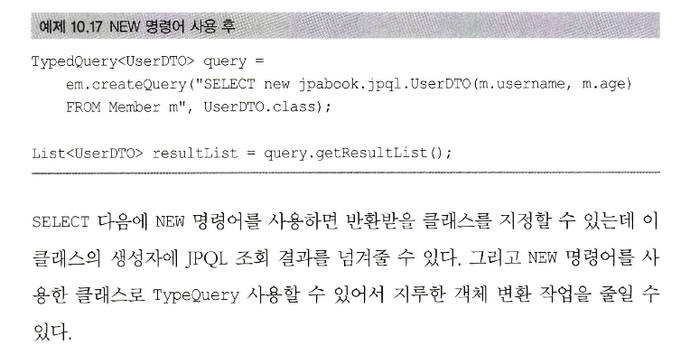
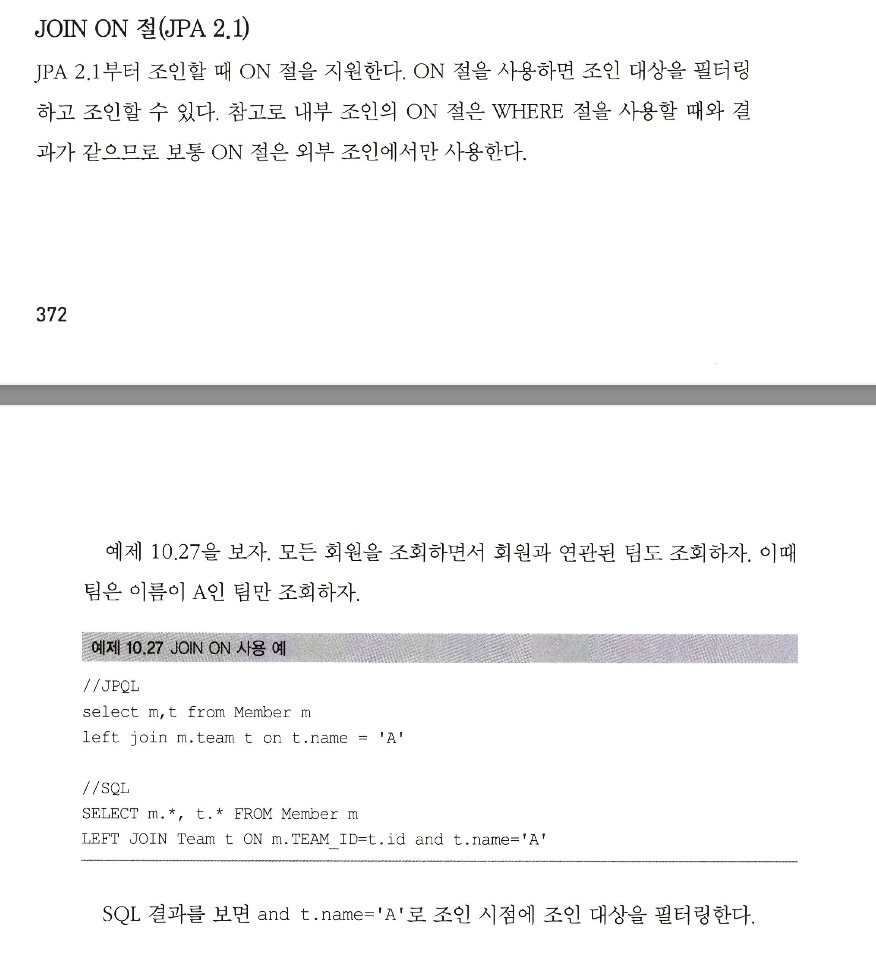
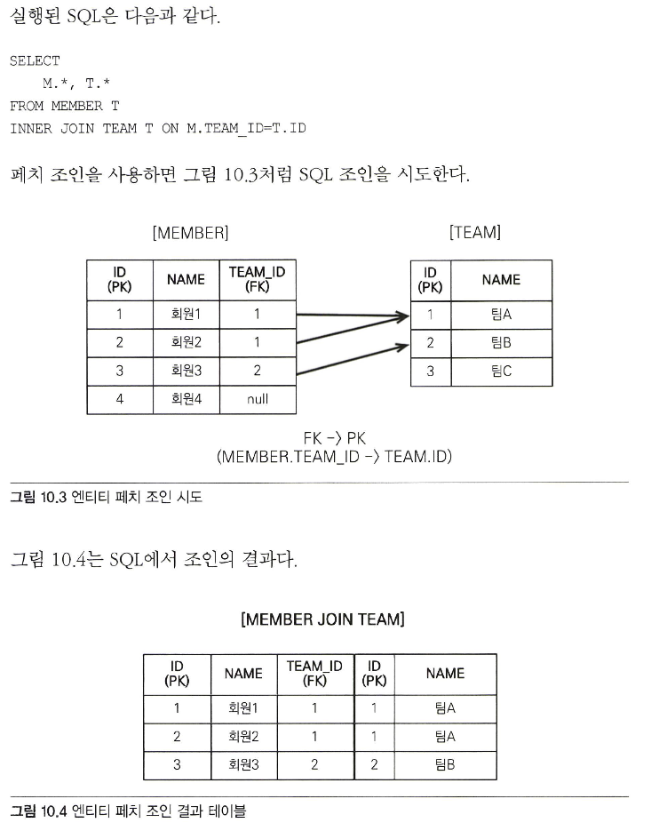
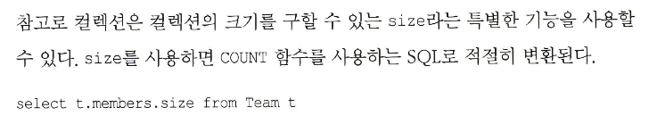
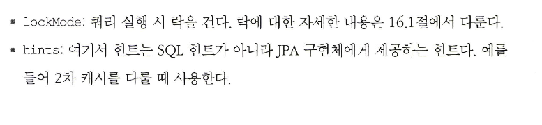

# 10.1 객체지향 쿼리 소개

Criteria / queryDSL 등은 결국 JPQL을 편리하게 다루도록 해주는 기술이므로

JPQL을 잘 숙지해야 한다.

---

EntityManager.find() 메소드를 사용해서 식별자로 엔티티 하나를 조회 할 수 있고,

조회된 엔티티에 객체 그래프 탐색으로 연관된 엔티티들을 조회할 수 있다.

하지만 이 기능만으로 어플리케이션을 개발하기는 힘들다. 예를 들어

나이 30살 이상의 미필 남자만 검색하는 방법이 필요하다. 식별자로 모든 회원을 메모리에 올리고 컬렉션을 필터링 하는 방법은 현실성이 없다.

SQL로 결국에 조건문을 걸어서 가져와야 하는데 JPA는 엔티티를 대상으로 개발하므로 검색도 엔티티를 대상으로 하는 방법이 필요하다.

이를 위해 만든 기술이 JPQL이고, 아래와 같은 특징이 있다.

* 테이블이 아닌 객체를 대상으로 검색하는 객체지향 쿼리이다.
* SQL을 추상화해서 특정 DB SQL에 의존하지 않는다.

JPQL을 사용하면 객체를 대상으로 SQL을 만들어 데이터베이스를 조회하고 엔티티로 결과를 반환한다.

아래는 JPA가 공식으로 지원하는 기능들이다.

* JPQL : Java Persistance Query Language
* Criteria 쿼리 : JPLQ을 편하게 작성하도록 도와주는 빌더 클래스 모음
* 네이티브 SQL : JPA에서 JPQL 대신 직접 SQL을 사용할 수 있다.

아래는 JPA 공식 지원은 아니지만 알아둬야 한다.

* QueryDSL : Criteria 쿼리처럼 JPQL을 편하게 작성하도록 도와주는 빌더 클래스 모음, 비표준 오픈소스 프레임워크이다.
* JDBC 직접 사용 / MyBatis 같은 SQL 매퍼 프레임워크 사용

---

## 10.1.1 JPQL 소개
JPQL은 엔티티 객체를 조회하는 객체지향 쿼리이며 SQL을 추상화하여 특정 DB에 의존하지 않는다.

따라서 방언만 변경하면 DB를 교체해도 사용 가능하다. 간단한 예를 보자

~~~java
@Entity
public class Member {
    
    @Column
    private String name;
}

public static void main(String[] args) {
    String jqpl = "select m" +
                  "from Member as m" +
                  "where m.name = 'kim'";    
    
    List<Member> members = em.createQuery(jqpl, Member.class).getResultList();
}
~~~

테이블이 아닌 엔티티 Member를 대상으로 쿼리를 생성하였다. 

---

## 10.1.2 Criteria 쿼리 소개
Criteria는 JQPL을 생성하는 빌더 클래스다. 문자가 아닌 query.select(m).where(...) 처럼 프로그래밍 코드로 JQPL을 작성할 수 있다는

점이 장점이다. 이 경우, 직접 문자로 쿼리를 작성할때와 달리, 컴파일 타임에서 에러를 감지해준다는 장점이 있다.

추가적인 장점은 아래와 같다.

* 컴파일 시점에 오류를 발견할 수 있다.
* IDE를 사용하면 코드 자동완성을 지원한다.
* 동적 쿼리를 작성하기 편하다.

위에 JQPL로 작성한 쿼리를 criteria 쿼리를 사용해서 바꿔보자.

~~~java
    // criteria 사용 준비
    CriteriaBuilder cb = em.getCriteriaBuilder();
    CriteriaQuery<Membmer> query = cb.createQUery(Member.class);
    
    // 루트 클래스
    Root<Member> m = query.from(Member.class);
    
    // 쿼리 생성
    CriteriaQuery<Member> cq = query.select(m).where(cb.equal(m.get("userName)", "Kim"));
    
    List<Member> resultList = em.createQuery(cq).getResultList();)
~~~

하나 아쉬운점은 m.get("userName") 부분은 여전히 DB 컬럼 명을 문자열로 작성했다는 점이다.

뒤에 이 부분을 고치는 방법에 대해서 말해준다.

Criteria가 가진 장점은 많지만 모든 장점을 상쇄할 정도로 복잡하고 장황하다. 따라서 잘 안쓴다.

---

## 10.1.3 QueryDSL 소개
QueryDsl도 JPQL 빌더 역할을 한다. 근데 단순하고 사용하기 쉽다. Criteria를 사용하면 너무 복잡하다.

백문이 불여일견 한 번 보자.

~~~java
JPAQuery query = new JPAQuery(em);
QMember member = QMember.member;

List<Member> members = 
    query.from(member)
    .where(member.username.eq("kim"))
    .list(member);
~~~

단순하고 쓰기 쉽다. QMember는 어노테이션 프로세스를 사용해서 쿼리 전용 클래스를 만든 것이다.

---
## 10.1.4 네이티브 SQL 소개
JPQL을 사용하더라도 가끔은 특정 DB의 의존적인 기능을 사용할 떄가 있다. 예를 들어

오라클에서만 지원하는 CONNECT BY라던가 특정 DB에서만 동작하는 SQL힌트 같은 것이다.

이들은 전혀 표준화 되어 있지 않으므로 JPQL에서 사용할 수 없다. 이떄 쓰면 된다.

단 DB를 수정하면 같이 수정되어야 한다.

~~~sql
String sql = "SELECT ID, AGE, TEMI_ID, NAME FROM MEMBER WHERE NAME = 'kim ’ ”;
    
List<Member> resultList = em.createNativeQuery(sql, Member.class).getResultList();
~~~

---

## 10.1.5 JDBC 직접 사용, 마이바티스 같은 SQL 매퍼 프레임워크 사용

드물지만 JDBC 커넥션에 직접 접근하고 싶으면 JPA는 JDBC는 이를 지원하지 않으므로 JPA 구현체가 제공하는 방법을 사용해야 한다.

하이버네이트(구현체)에서 직접 JDBC Connection을 획득하는 방법은 아래와 같다.

~~~java
Session session = entitiyManager.unwrap(Session.class);

session.doWork(new Work() {
    @Override
    public void execute(Connection connection) throws SQLException {
        
        }
    });
~~~

먼저 JPA Entity Manager에서 하이버네이트 Session을 구한 후 Session에 doWork 메서드를 호출하면 된다.

JDBC나 마이바티스를 JPA와 함께 사용하면 영속성 컨텍스트를 적절한 시점에 강제로 플러시 해줘야 한다.

JDBC를 직접 사용하든 마이바티르 같은 SQL 매퍼를 사용하든 모두 JPA를 우회해서 데이터베이스에 접근한다.

하지만 JPA를 우회하는 SQL에 대해서 JPA가 인식을 못한다는 점이다. 최악의 시나리오는 영속성 컨텍스트와 DB 불일치로 데이터 무결성을 훼손할수있다.

이런 이슈를 해결하는 방법은 JPA를 우회해서 SQL을 실행하기 전에 영속성 컨텍스트를 플러시해서 동기화 하면 된다.

참고로 스프링을 쓰면 JPA와 마이바티스를 손쉽게 통합할 수 있다. 또한 AOP를 사용하면 JPA를 우회하여 DB에 접근하는 메서드를 호출할때마다

영속성 컨텍스트를 플러시하여 손쉽게 해결할 수 있다.

---

# 10.2 JPQL

다시 한 번 JPQL의 특징을 소개하고 시작해보자.

* JPQL은 객체지향 쿼리 언어이므로 테이블이 아닌 엔티티 객체를 대상으로 쿼리한다.
* JPQL은 SQL을 추상화해서 특정 DB에 의존하지 않는다.
* JPQL은 결국 SQL로 변환된다.

---

## 10.2.1 기본 문법과 쿼리 API

저장할때는 em.persist를 사용하면 되므로 이를 제외한 SELECT, UPDATE, DELETE문을 사용할 수 있다.

### SELECT 문

아래와 같이 사용한다.

~~~
SELECT m FROM Member AS m where m.username = 'shin';
~~~

* 대소문자 구분
  * 엔티티와 속성은 대소문자를 구분한다. 예를 들어, Member, username은 대소문자를 구분한다
  * 반면에 SELECT, AS 등과 같은 JPQL 키워드는 대소문자를 구분하지 않는다.
* 엔티티 이름
  * JPQL에서 사용한 Member는 클래스가 아니고 엔티티 명이다.
* 별칭은 필수
  * Member as m 을 보면 Member에 m이란 별칭을 주었는데 JPQL은 별칭을 필수로 줘야 한다.
  * 하이버네이트는 HQL도 지원하는데 나중에 알아보자..

---

### TypeQuery, Query
JPQL을 실행하려면 쿼리 객체를 만들어야 하는데 반환 타입이 명확하면 TypeQuery / 그렇지 못하면 Query 객체를 사용하면 된다.

아래 예제를 보자.

~~~java
TypedQuery<Member> query = em.createQuery("select m from Member m", Member.class);

List<Member> resultList = query.getResultList();

for (Member member : resultList) {
    어쩌구저쩌구..
}
~~~

---

### 결과 조회

다음 메소드들을 호출하면 실제 쿼리를 실행해서 디비를 조회한다.

~~~java
public static void main(String[]args){
    query.getResultList() : 결과를 예제로 반환한다. 만약 결과가 없으면 빈 컬렉션이 반환된다.
    query.getSingleResult() : 결과가 하나일때 사용된다. 결과가 없거나 1개 보다 많으면 각각
        NoResultException / NonUniqueResultException이 발생한다.
}
~~~

---

## 10.2.2 파라미터 바인딩
JDBC는 위치 기준 파라미터 바인딩만 지원하지만 JPQL은 이름 기준 파라미터 바인딩도 지원한다.

이름 기준 파라미터는 파라미터를 이름으로 구분하는 방법이고 예제는 아래와 같다.

~~~java
{
    String userName = "원호";
    
    TypedQuery<Member> query = 
        em.createQuery("select m from Member m where m.userName = :userName", Member,class);
    
    query.setParameter("userName", userName);
    
    List<Member> members = query.getResultList();
~~~

참고로 JPQL API는 대부분 체이닝을 제공하고 있어서 아래처럼 작성가능하다.

~~~java
List<Member> members = 
        em.createQuery("select m from member m where m.userName = :userName", Member.class)
        .setParameter("userName", userName)
        .getResultList():
~~~

### 위치 기준 파라미터
위치 기준 파라미터를 사용하려면 ? 를 주면 된다. ?는 1부터 시작한다.

이름 기준 파라미터 파인딩을 써라.

---

## 10.2.3 프로젝션
Select 절에 조회할 대상을 지정하는 것을 프로젝션이라 하고, select 프로젝션 대상 from 으로 대상을 선택한다.

프로젝션 대상은 엔티티 / 임베디드 타입 / 스칼라 타입 등이 있다.

### 엔티티 프로젝션
엔티티를 대상으로 지정한 경우이다.

~~~java
select m from Member m;
select m.team from Member m
~~~

이렇게 조회된 엔티티는 영속성 컨텍스트에서 관리된다.

---

### 임베디드 타입 프로젝션
JQPL에서 임베디드 타입은 엔티티와 거의 비슷하게 사용된다. 임베디드 타입은 조회의 시작을 알 수 없다는 제약이 있다.

아래는 Member의 Address를 조회의 시작점으로 잘못 선택한 쿼리이다.

~~~
String query = "SELECT a from Address a";
~~~

아래처럼 해야 한다.

~~~
String query = "SELECT o.address from Order.o";
List<Address> addresses = em.createQuery(query, Address,class).getResultList();
~~~

임베디드 타입은 엔티티가 아니고 값이다. 그러므로 영속성 컨텍스트에서 관리되지 않는다.

---

### 여러 값 조회

엔티티 말고 필요한 컬럼들만 대상으로 조회를 해야할 떄도 있다.

이때는 typeQuery를 사용할 수 없고 대신에 Query를 사용해아 한다.

~~~java
Query query = em.createQuery("select m.userName, m,age from Member m");

List resultList = query.getResultList();

Iterator iterator = resultList.iterator();

while(iterator.hasNext()) {
    Object[] row = (Object[]) iterator.next();
    String userName = (String) row[0];
    Integer age = (Integer) row[1];
}
~~~

제네륵을 활용해서 아래처럼 좀 더 간결하게 할 수도 있다.

~~~java
List<Object[]> resultList = em.createQuery("select m.userName, m,age from Member m");
        .getResultList();
        
for (Object[] row : resultList) {
        String name = (String) row[0];    
        Integer age = (Integer) row[1];
}
~~~

---

---

## 10.2.4 페이징 API
JPA는 페이징을 두 API로 추상화 했다.

setFirstResult(int startPosition) : 조회 시작 위치 (0 based)
setMaxResults(int maxResult) : 조회할 데이터 수

~~~java
TypedQuery<Member> query = 
    em.createQuery("select m from Member m order by m.userName desc", Member.class);

    query.setFirstResult(10);
    query.setMaxResults(20);
    query.getResultList();
~~~

위를 분석하면 11~30 데이터를 가져오는 것이다.

---

## 10.2.5 집합과 정렬
집계 함수는 어래 처럼 사용한다.

---

## 10.2.6 JPQL 조인
SQL 조인이랑 비슷하다.

### 내부 조인 (Inner Join)
inner는 생략 가능하다.

~~~java
String teamName = "a";

String query = "select m from Member m join m.team t where t.name = :teamName";

List<Member> members = em.createQuery(query, Member.class)
        .setParameter("teamName", teamName)
        .getResultList();
~~~

외부조인도 동일하다.

한가지 특이점은 조인할 엔티티가 team 이 아니고 m.team 이라는 것이다.

연관관계를 맺는 필드를 통해 작성해야 한다.

---

---

## 10.2.7 페치 조인
패치 조인은 SQL 성능 최적화 기능을 제공하는데 연관 엔티티나 컬렉션을 한번에 같이 조회하는 기능이며

join fetch 명령어로 사용할 수 있다.

---

### 엔티티 패치 조인
페치 조인을 사용해서 회원 엔티티를 조회하며 연관된 팀 엔티티도 함께 조회하는 JQPL을 보자.

~~~
select m
from Member m join fetch m.team;
~~~

member / team 엔티티를 함께 조회한다. JPA에서는 m.team 에 별칭이 없다. fetchJoin 에서는 별칭이 없다.

근데 하이버네이트는 있다.

select m만 했는데 m, t 모두를 조회했다.

또한 10.5를 보면 연관관계가 모두 로딩된 것을 알 수 있다.

패치 조인을 쓰면 이렇게 연관관계도 함께 로딩되기 때문에 m.getTeam()을 해도 지연로딩이 발생하지 않는다.

반환된 엔티티도 프록시가 아닌 실제 엔티티 이다.

---

### 컬렉션 패치 조인
일대다 관계인 컬렉션을 패치 조인 해보자.

~~~
select t
from Team t 
join fetch t.members
where t.name = 'a'
~~~

---

### 패치 조인과 DISTINCT
위 이유 때문에 DISTINCT 키워드를 쓰는데 JPA에 DISTINCT는 SQL 기능과 좀 다른게

SQL에도 추가하고, 애플리케이션에서 한 번 더 중복을 제거한다.

아래처럼 해보자.

~~~
select Distinct t
from Team t join fetch t.members
where t.name = '팀A'
~~~

SQL에 distinct가 추가된다. 하지만 지금은 각 로우의 데이터가 다르므로 효과가 없다.

이제 애플리케이션에서 중복을 한 번 걸러낸다. select distinct t는 팀 엔티티의 중복을 제거하라는 뜻이다.

그러므로 아래처럼 조회가 된다.

---

### 페치 조인과 일반 조인의 차이

페치 조인은 명세된 연관관계도 같이 가져오지만 일반 조인은 안가져온다.

JQPL은 결과를 반환할때 연관관계까지 고려하지 않고 select 절에 지정한 엔티티만 조회한다.

그러므로 일반 조인은 지연로딩이 된어 프록시가 반환된다. (연관관계에)

---

### 페치 조인의 특징과 한계
* 한번에 연관관계 엔티티를 조회할 수 있어서 성능에 좋다.
* 페치 조인은 글로벌 로딩 전략보다 우선순위가 높다. (엔티티 등에 명세)
* 패치 조인 대상에는 별칭을 줄 수 없다.
  * select / where / 서브 쿼리에서 사용할 수 없다.
* 둘 이상의 컬렉션을 패치할 수 없다.
* 컬렉션을 패치 조인하면 페이징을 사용할 수 없다

그냥 필요한 필드들만 프로젝션으로 DTO로 만들어서 반환하는게 더 효과적일 수 있다.

---

## 10.2.8 경로 표현식
경로 표현식에 대해 알아보자

이렇게 점찍어서 표현한게 경로 표현식이다.

---

### 경로 표현식 용어 정리

---

### 경로 표현식과 특징
* 상태 필드 경로 : 경로 탐색의 끝이다 더는 탐색할 수 없다.
  * t.user.age 등은 불가능하다.
* 단일 / 컬렉션 값 연관 경로는 묵시적으로 내부 조인이 일어난다.
  * 단일 : 계속 탐색 가능
  * 컬렉션 : 계속 탐색 하려면 FROM 절에서 조인을 통해 별칭을 얻으면 별칭으로 탐색이 가능하다.

---

### 상태 필드 경로 탐색

---

### 단일 값 연관 경로 탐색

단일 값 연관 필드로 경로 탐색을 하면 내부 조인이 일어나는데 이를 묵시적 조인이라고 하며 모두 내부 조인이다.

---

---

### 컬렉션 값 연관 탐색

---

## 10.2.9 서브쿼리
서브쿼리는 where / having 에만 사용할 수 있다.

---

### 서브 쿼리 함수

---

## 10.2.10 조건식

---

## 10.2.14 엔티티 직접 사용
엔티티 식별자 대신에 엔티티 그 자체를 넣어도 된다.

---

## 10.2.15 Named 쿼리 : 정적 쿼리

---
# 질문
1. 어노테이션 프로세서를 통해 queryDSL 클래스를 만든다.
2. 10.2.7 패치조인은 그러면 프로젝션 생성 + 일반 조인으로 해결하면 되는 것인가...!!