# 목차
- [1.1 SQL을 직접 다룰 때 발생하는 문제점](#11-sql------------------)
   * [1.1.1 반복, 반복 그리고 반복](#111--------------)
   * [1.1.2 SQL에 의존적인 개발](#112-sql---------)
   * [1.1.3 JPA와 문제 해결](#113-jpa-------)
      + [저장기능](#----)
      + [조회기능](#----)
      + [수정 기능](#-----)
      + [연관된 객체 조회](#---------)
- [1.2 패러다임의 불일치](#12----------)
   * [1.2.1 상속](#121---)
      + [JPA와 상속](#jpa----)
   * [1.2 연관관계](#12-----)
      + [객체를 테이블에 맞춰 모델링](#---------------)
      + [객체지향 모델링](#--------)
      + [JPA와 연관관계](#jpa------)
   * [1.2.3 객체 그래프 탐색](#123----------)
      + [JPA와 객체 그래프 탐색](#jpa-----------)
   * [1.2.4 비교](#124---)
      + [JPA와 비교](#jpa----)
   * [1.2.5 정리](#125---)
- [1.3 JPA란 무엇일까?](#13-jpa-------)
   * [1.3.1 JPA 소개](#131-jpa---)
   * [1.3.2 왜 JPA를 써야 하는가?](#132---jpa---------)
- [Q&A ORM에 대한 궁금증과 오해](#q-a-orm------------)
- [후기](#--)

<small><i><a href='http://ecotrust-canada.github.io/markdown-toc/'>Table of contents generated with markdown-toc</a></i></small>

---

# 1.1 SQL을 직접 다룰 때 발생하는 문제점
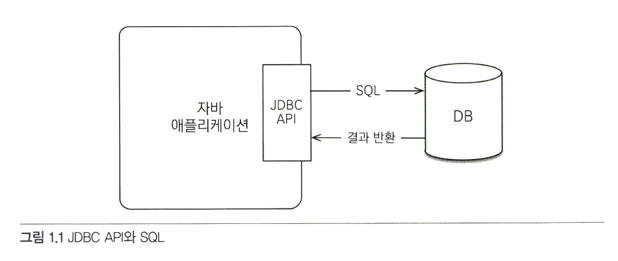

웹 어플리케이션 개발에서 많은 개발자들이 RDB를 데이터 저장소로 사용한다.

JDBC API를 사용해서 SQL을 데이터베이스로 전달한다.

## 1.1.1 반복, 반복 그리고 반복
SQL을 직접 다룰 때의 문제점을 알아보자. 이를 위해 회원 객체를 만들고, 회원 DAO를 만든다.

~~~java
public class Member {
    private String memberId;
    private String name;
}
~~~

~~~java
public class MemberDAO {
    public Member find(String memberId) {
        ...
    }
}
~~~

---

>위 코드를 통해 회원을 조회하는 기능을 만들어보자.

1. 회원 조회용 SQL 생성 
    ~~~
    select member_id, name from member m where member_id = ?
    ~~~
2. JDBC API를 사용해서 SQL을 실행한다.
    ~~~java
   ResultSet rs = stme.executeQuery(sql);
   ~~~ 
3. 조회 결과를 Member 객체로 매핑한다.
~~~java
String memberId = rs.getString("member_id");
Member member = new Member();
member.setMemberId = member.setMemberId(memberId);
~~~

---

> 다음으로는 회원 등록 기능을 만들어본다.
~~~java
public class MemberDAO {
    public Member find(String memberId) {
        ...
    }
    
    public void save(Member member) {
        ...
    }
}
~~~

1. 회원 등록용 SQL을 작성한다.
~~~java
String sql = "insert into member (member_id, name) values (?,?)";
~~~
2. 회원 객체의 값을 꺼내서 등록 SQL에 전달한다.
~~~java
pstmt.setString(1, member.getMemberId());
pstmt.setString(2, member.getName());
~~~
3. JDBC API를 사용해서 SQL을 실행한다.
~~~
psmt.executeUpdate(sql);
~~~
---

기능들이 추가 될 때마다 위와 같이 SQL을 작성하고, 객체를 세팅하고, JDBC API로 통신하는 과정이 필요하다.

1:N의 경우에는 어떨까? 자바의 경우 컬렉션에 list.add(member); 와 같이 더하면 되지만 데이터 베이스는 불가능하다.

즉, 개발자가 DB와 어플리케이션 중간에서 변환 작업을 해줘야한다.

> 문제는 위와 같은 과정이 너무많이 필요하다는 것이다.
> 
> 지루함과 반복의 연속이다.

---

## 1.1.2 SQL에 의존적인 개발
위와 같이 개발이 종료된 후에 클라이언트의 요구로 회원의 전화번호를 추가로 저장해달라는 요구조건이 왔다.

위 경우에서는 Member 클래스에 SQL을 수정하고, MemberDAO에 DB로 요청하는 쿼리들을 모두 수정해줘야한다.

SQL도 수정해줘야 하고, 자바코드도 수정해줘야한다. 실수라도 한다면 잘못 동작한다.

또한 메서드 명과 상관없이 결국에 SQL에 대해 데이터가 결정되기 때문에

DAO 계층에 SQL을 숨겼다고 해도, SQL을 열어보기 전까지는 DAO 계층에 작성된 메서드는 제 역할을 하는지 보장되지 않는다.

> 위와같은 상황에서 개발자들은 엔티티(요구사항에 대한 객체 모델링)을 신뢰할 수 없다.
> 
> 논리적으로 DAO와 데이터가 강한 의존성을 갖게 된다.
> 
> 아래와 같은 문제점이 크다.
> > 1. 진정한 의미의 계층 분할이 어렵다.
> > 2. 엔티티를 신뢰할 수 없다.
> > 3. SQL에 의존적인 개발을 피하기 어렵다.

---

## 1.1.3 JPA와 문제 해결
위와같은 상황에 해결책은 JPA이다.

우선 JPA가 위 문제들을 어떻게 해결하는지 알아보자.

JPA에서는 쿼리를 직접 개발자가 작성하지 않고, JPA가 제공하는 API를 사용하면 된다.

이 경우, JPA가 개발자 대신에 SQL을 작성하여 DB에 전달한다.

### 저장기능
~~~java
jpa.persist();
~~~

persist() 메소드는 객체를 데이터베이스에 저장한다.

호출 시, JPA가 객체와 매핑정보를 보고 적절한 INSERT SQL을 생성하여 DB에 전달한다.

매핑코드를 어떻게 관리할지는 나중에 설명한다.

---

### 조회기능
~~~java
String memberId = "hi";
Member member = jpa.find(Memer.class, memberId); // 조회
~~~

find() 메소드는 객체 하나를 DB에서 조회한다. JPA는 객체와 매핑정보를 보고 적절한 SELECT SQL을 생성하여 DB에 전달한다.

응답받은 정보로 Membere객체를 생성해서 반환한다.

---

### 수정 기능
~~~java
Member.member = jpa.find(Member.class, memberId);
member.setName("이름바꾸기"); // 수정

JPA는 별도의 수정 메소드를 제공하지 않고, 조회된 객체의 값을 변경하면 트랜젝션을 커밋할 때 데이터베이스에 적절한 UPDATE SQL이 전달된다.
~~~

---

### 연관된 객체 조회
~~~java
Member member = jpa.find(Member.class, memberId);
member.getTeam();
~~~

JPA는 연관된 객체를 사용하는 시점에서 적절한 SELECT SQL을 실행한다. 따라서 JPA를 사용하면 연관된 객체를 마음껏 조회할 수 있다.

---

> 수정기능과 연관 객체 조회 기능을 살펴보면 JPA는 단순하게 SQL을 생성해주는 것 이상의 것들을 제공하고 있다. 
> 
> 나중에 또 알아보자.

---

# 1.2 패러다임의 불일치
자바로 개발하다보면 어플리케이션이 크고 복잡해져도 객체지향적 패러다임에 의해서 그 복잡도를 낮출 수 있다.

마찬가지로 비지니스 요구사항을 정의한 도메인 모델 (엔티티) 역시 객체로 모델링하면 그 복잡도를 낮출 수 있다.

하지만 이를 DB에 저장할 때 문제점이 발생한다.

객체와 DB 테이블은 페러다임이 다르기 때문이다. 객체의 참조나 혹은 상속 같은 것들이 디비에서는 표현할 수 없는 값들이다.

자바 어플리케이션은 객체지향적으로, DB와의 패러다임 불일치는 개발자가 작성해줘야 하는 부분들이다.

이러한 문제들을 JPA에서 해결할 수 있다.

## 1.2.1 상속
객체는 상속이 있지만 테이블은 없다.

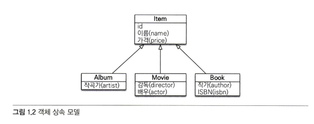

~~~java
abstract class Item {
    private long id;
    private String name;
    private int price;
}

class Album extends Item {
    private String artist;
}
~~~

자바에서는 Album 객체를 DB에 저장하려면 SQL이 두 개를 작성해야 한다.

조회에서도 두 테이블을 조인한 후에 결과 값을 Album 객체 생성 시 세팅해줘야 한다.

이런 과정이 모두 패러다임의 불일치를 해결하려고 소모하는 비용이다.

### JPA와 상속
JPA는 상속과 관련된 패러다임의 불일치 문제 (위에 서술)을 개발자 대신 해결해준다.

개발자는 마치 자바 컬렉션에 객체를 저장하듯 JPA에게 객체를 저장하면 된다.

JPA를 사용하여 ITEM을 상속한 Album 객체를 저장해보자. 앞서 설명한대로 persist(); 메서드를 호출하면 된다.

~~~java
jpa.persist(album);
~~~

다음으로 앨범을 조회해보자

~~~java
Album album = jpa.find(Album.class, albumId);
~~~

JPA는 필요한 테이블을 조인해서 값을 가져온다.

---

## 1.2 연관관계
여기에서도 패러다임의 불일치는 존재한다. 객체는 참조를 통해 다른 객체와 연관관계를 맺고, 디비는 외래키를 통한 컬럼으로 연관관계를 맺는다.

이 차이에 대해 설명한다.

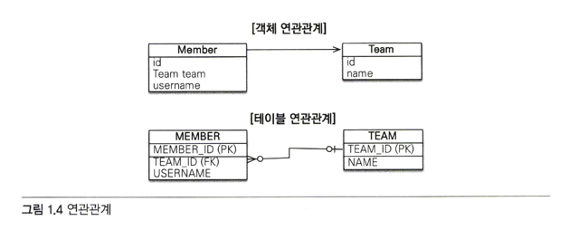

객체는 또한 참조가 있는 방향으로만 연관관계에 접근할 수 있지만, DB는 조인을 통해 외래키로 양방향 모두 접근이가능하다는 차이가 있따.

### 객체를 테이블에 맞춰 모델링
~~~java
class Member {
    private long id;
    private String name;
    private long teamId;
}
~~~

위 처럼 테이블에 맞춰 객체를 모델링 한다면, 조회나 저장에는 편할 수 있어도 Member에 소속된 Team 정보를 가져오려면 다시 SQL을 작성해서
DB와 통신해야 한다.

외래키를 저장하는 방식은 그러므로 문제점을 내포하고 있다. 객체의 특징을 전혀 사용할 수 없다.

---

### 객체지향 모델링
객체를 테이블에 맞춰 설계하면 발생하는 문제점을 알아봤다. 그렇다면 객체지향적으로 설계하면 어떨까?

~~~java
class Member {
   private long id;
   private String name;
   private Team team;
}

class Team {
   private long id;
   private String name;
}
~~~

이제 team 인스턴스 변수를 통해 회원에서 팀으로의 연관관계를 참조할 수 있다.

하지만 이렇게 하려면 CRUD 시, team 객체에 세팅을 해줘야 하는 문제점이 발생한다.

테이블은 외래키를 통해, 객체는 참조를 통해 연관관계를 찾는 차이가 있기 때문이다

결국 중간에서 개발자가 변환을 해줘야 한다.

---

### JPA와 연관관계
객체지향적으로 모델링을 해도, 테이블에 맞춰서 모델링을 해도 문제점은 해결되지 않는다.

문제점은 테이블과 객체 사이의 차이점 때문에 발생한다. 이를 마찬가지로 JPA를 통해 극복한다.

~~~java
// 저장
member.setTeam(team);
jpa.persist(member);

// 조회
Member member = jpa.find(Member.class, memberId);
Team team = member.getTeam();
~~~
해결법은 엔티티를 통해 객체지향적 모델링(참조를 가지고 있는 것, 외래키 말고) 후에 JPA를 사용하여 패러다임을 극복하면 된다.

---

## 1.2.3 객체 그래프 탐색
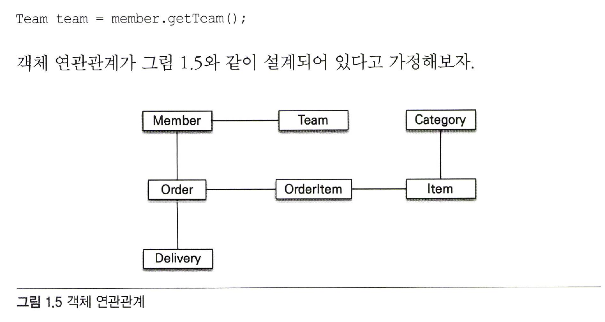

말이 어려워서 그렇지 참조를 통해 다른 객체에 접근하는 것을 객체 그래프 탐색이라고 한다.

SQL을 직접 다루게 된다면 DB에서 참조 데이터를 가져와서 세팅하지 않으면 접근 할 수 가 없다.

SQL에 따라 어디까지 참조가 가능한지 결정되는 것이다.

이는 엔티티(도메인 모델, 테이블을 객체로 표현)가 결국에 SQL에 종속성을 가지게 된다는 의미이다.

SQL을 어떻게 작성해서 데이터를 가져오냐에 따라 개발자는 엔티티를 통해 객체에 접근할 수 있다.

예를 들어 Member.getOrder(); 은 주문을 조회한 후에나 접근이 가능할 것이고,

Order.getOrderItem 역시 동일하다.

이런 상황에서는 필요에 따라 엔티티에 일부, 혹은 전체를 가져오는 SQL을 작성하여 엔티티를 구성해야 하는데 

이를 개발자가 계속 작성해줘야 한다면 미쳐버릴 수도 있다.

---

### JPA와 객체 그래프 탐색

JPA가 개발자가 극복해야할 패러다임을 대신 작성해주기 때문에 이 역시 극복할 수 있다.

~~~java
member.getOrder().getOrderItem();
~~~

이처럼 작성한다면 연관된 객체를 사용하는 시점에 알아서 SQL을 작성해서 DB로 질의하기 때문에 개발자는 엔티티를 신뢰하고 사용할 수 있다.

사용시점까지 DB조회를 미루는 점에 이름을 따서 이를 지연로딩이라고 한다.

지연로딩을 제공하지만 마찬가지로 즉시로딩도 지원하고 있다.

그리고 이를 지원하는 방법은 비지니스 로직에서 표현하지 않는다.

즉, 비지니스로직 코드에 영향을 주지 않고 가능하다.

---

## 1.2.4 비교
DB는 기본 키 값으로 각 row를 구분하고 객체는 동일성, 동등성 비교를 사용한다.
> 동일성 비교는 == 비교이고, 객체 인스턴스의 주소 값을 비교한다.
> 
> 동등성 비교는 equals() 메서드를 사용하여 객체 내부 값들을 비교 한다.

아래 코드를 보자

~~~java
Member member1 = MemberDAO.getMember(1);
Member member2 = MemberDAO.getMember(1);

member1 == member2 // false
~~~

반환된 인스턴스의 주소를 비교하기 때문에 false를 반환한다.

~~~java
Member member1 = list.get(1);
Member member2 = list.get(1);

member1 == member2 // true;
~~~

객체에 주소를 나타내기 때문에 컬렉션을 사용할 때는 true를 반환한다.

---
### JPA와 비교
jpa에서는 같은 트랜젝션일 때 같은 객체가 조회되는 것을 보장한다. 그러므로 아래 코드가 성공한다.

~~~java
Member member1 = jpa.find(1);
Member member2 = jpa.find(1);

member1 == member2 // false
~~~

---

## 1.2.5 정리
디비와 객체는 위처럼 많은 차이점들이 있고, 객체를 디비에 맞춰 모델링 한다고 해도 차이점을 극복하기 위해서

개발자가 계속해서 차이점을 극복하는 코드를 작성해야 한다.

이는 비지니스 요구사항이나 엔티티 복잡도가 커질수록 엄청나게 불어난다. 

근데 JPA를 사용하면, 이 차이점을 설정을 통해서 극복하여 개발자가 신경쓰지 않아도 된다.

개발자는 비지니스 로직 코드에 집중할 수 있고, 변경이 있을때 코드의 수정은 최소화된다.

# 1.3 JPA란 무엇일까?
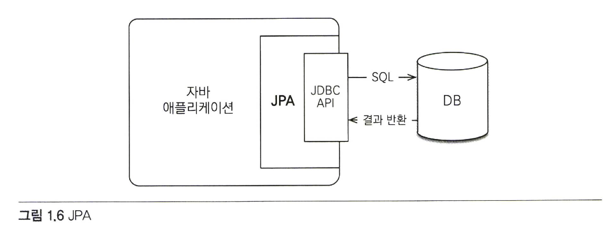

JPA는 자바진영의 ORM 기술 표준이다.

ORM은 Object Relational Mapping의 약어로 객체와 DB를 매핑한다는 뜻이다.

그러니 JPA는 자바에서 사용하는 표준 객체, DB 매핑인 것이다.

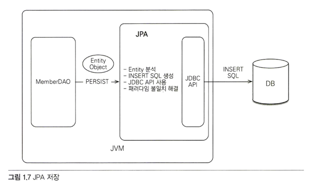

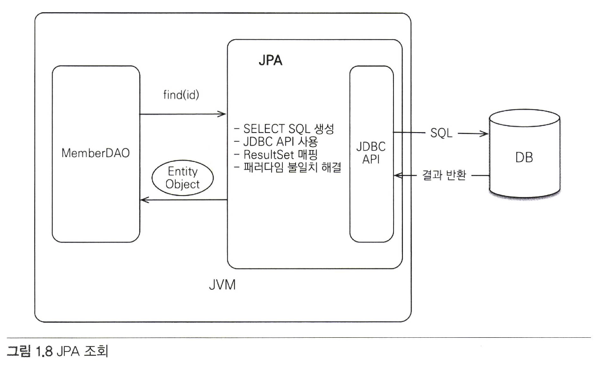

ORM 프레임워크를 사용하면 단순하게 SQL만 대신 작성해주는 것 뿐만 아니고, 위에서 소개한 다양한 패러다임의 차이를 극복하게 해준다.

따라서 객체 측면에서는 정교한 객체 모델링이 가능해진다.

이 둘을 어떻게 매핑 해야 하는지만 ORM 구현체에게 알려주면 된다.

이 경우, 개발자들은 비지니스로직을 처리하는데만 집중할 수 있다.

ORM 구현체 중에 많이 쓰이는 것은 하이버네이트가 있다. 대부분의 패러다임 불일치 문제를 해결해준다.

---

## 1.3.1 JPA 소개
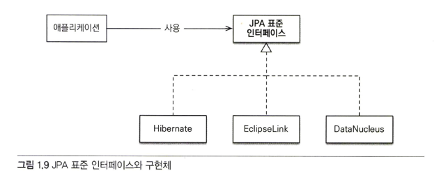

과거 자바에서 엔터프라이즈 자바 빈즈라는 기술표준이 있었는데 이때 엔티티 빈이라는 ORM 프레임워크도 포함되어 있었다.

후져서 하이버네이트라는 오픈소스 ORM 프레임워크가 등장했는데 잘 만들어서 많은 사람들이 사용했다.

결국에 EJB 3.0에서부터 엔티티 빈은 없어지고 하이버네이트가 채택되면서 새로운 자바 표준이 만들어졌는데 이게 JPA 이다.

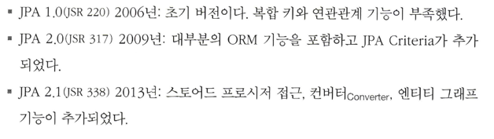

간단한 특징인데 이를 알아야 하는 이유는, JPA 버전을 선택할 때 필요하기 때문이다.

프로젝트에 들어갔는데 갑자기 JPA2.0을 쓴다고 하면 시발 그러면 스토어드 프로시저나 엔티티 그래프 못 쓰잖아요 해야 한다.

이 외에도 추가적으로 업데이트가 될 때마다 간단하게 내용을 알 필요가 있다.

---

## 1.3.2 왜 JPA를 써야 하는가?
> 생산성
> > SQL을 작성해서 JDBC API를 호출할 필요없이 자바 객체를 다루듯 엔티티를 생성해서 JPA에게 위임하면 된다.
> >
> > 이를 통해 지루한 SQL 작성을 피할 수 있다. 더 나아가서 DDL도 자동으로 생성해주는 기능도 있다.
> >
> > 이를 통해 DB 설계 중심의 패러다임을 객체 중심 설계로 역전시킬 수 있다.
> 
> 유지보수
> > SQL에 의존적인 개발을 하면 필드 하나만 추가되어도 엔티티에 대해 CRUD를 모두 변경해줘야 한다.
> > 
> > 또한 결과를 매핑하는 JDBC API 코드도 모두 수정해줘야 한다. 하지만 이를 JPA가 대신 처리해주므로 유지보수에 대상이 되는 코드가 줄어든다.
> >
> > 또한 패러다임 불일치문제를 해결해주므로 객체지향 언어의 장점을 활용해서 유지보수에 좋은 도메인 모델을 설계할 수 있게 된다.
> 
> 성능
> > JPA는 어플리케이션과 DB사이에 다양한 성능 최적화를 제공한다.
> >
> > 계층이 하나 더 있다는 뜻은 최적화 관점에서 여러 시도할만한 점들이 많다는 것이다. 예를 들어 JPA를 통해 동일한 엔티티를 트랜젝션 내에서 2번
> >
> > 호출하게 되면 두 번째 호출에서는 SQL이 전달되지 않는다. 또한 하이버네이트 구현체는 SQL에 힌트를 넣을 수 있는 기능도 있다.
> 
> 데이터 접근 추상화와 벤더 독립성
> > RDB는 같은 기능도 벤더마다 사용법이 다른 경우가 많다. 단적으로 페이징 처리는 DBMS마다 달라서 결국, 처음 선택한 DB기술에 종속되고 만다.
> > 
> > 이 경우, DB 교체는 매우 어렵다. 하지만 JPA는 아래 그림처럼 DB와 에플리케이션 사이에 추상화된 데이터 접근 계층을 제공하기 때문에
> >
> > 특정 DB에 종속되지 않는다. 
> >
> > 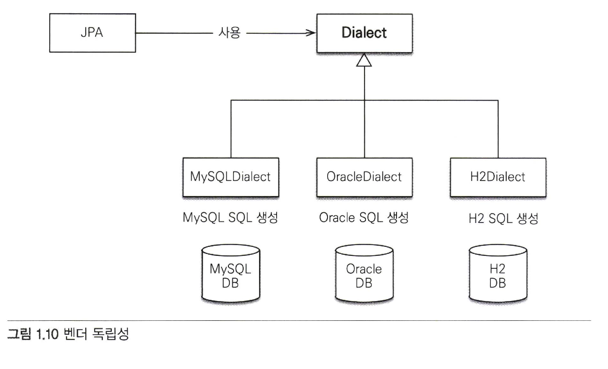

---

# Q&A ORM에 대한 궁금증과 오해

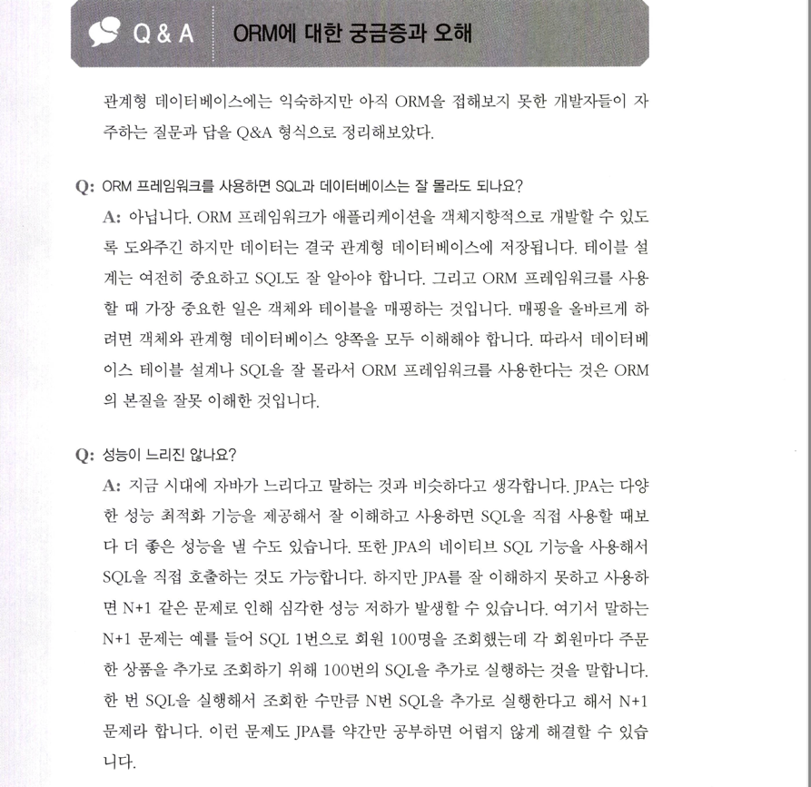

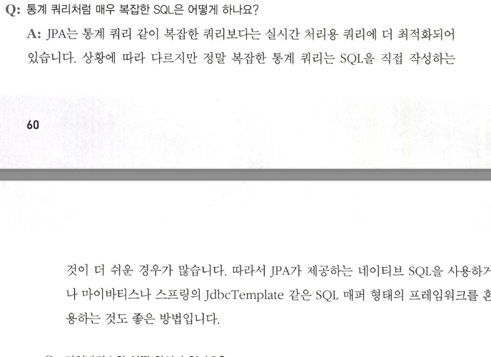

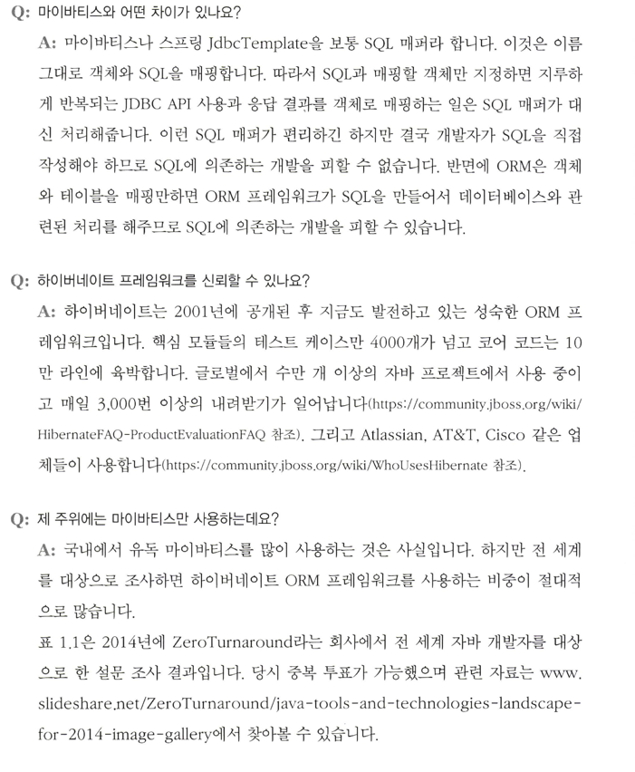

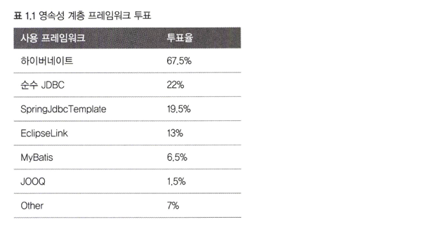

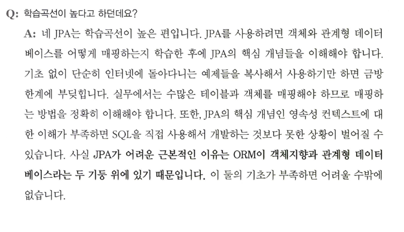

---

# 후기
간단하게 JPA를 사용하면 어떤 장점이 있는지 소개해주는 챕터였다.

JPA - hibernate를 사용하기 전과 이후의 개발 방법에 대한 차이를 소개해주며 JPA에 대한 소개를 했다.

인상적인 부분은 DB와 어플리케이션 사이에 층을 추가하여 개발자가 해줘야 하는 패러다임 극복 코드를 대신 처리해주는 부분이다.

계층을 추가하여, 추가된 계층에서 AOP처럼 관점을 분리하여 중복되고 필요한 부분들을 처리해주는 동작방식이 인상적이었다.

>JPA와 AOP는 개발자가 특정 관심 영역을 분리하고 모듈화하는 데 도움을 주는 방식에서 유사성이 있습니다.
> 
> JPA는 객체와 관계형 데이터베이스 간의 매핑을 자동으로 처리하여 개발자가 직접 SQL 쿼리를 작성하지 않고도 데이터베이스와 상호작용할 수 있도록 도와줍니다.
> 
> 이로써 개발자는 객체 지향적인 관점에서 개발에 집중할 수 있습니다.
>
> 한편 AOP는 관점 지향 프로그래밍 패러다임으로, 공통된 관심사를 분리하여 모듈화하고 재사용성을 높이는 데 중점을 둡니다.
> AOP를 사용하면 특정 관심 영역(로깅, 트랜잭션 처리, 예외 처리 등)을 다른 모듈로 분리하여 코드의 간결성과 유지보수성을 향상시킬 수 있습니다.
> 
> JPA는 데이터베이스 매핑을 자동으로 처리함으로써 개발자가 데이터베이스와의 상호작용에 대한 많은 부분을 추상화하고 분리합니다. AOP는 관점을 분리함으로써 특정 관심 영역을 모듈화합니다. 
>
> 따라서 두 기술은 모두 개발자가 핵심 비즈니스 로직에 집중하고 공통 로직을 분리하여 코드의 가독성과 유지보수성을 높이는 데 기여합니다
 
What과 why를 항상 생각하는게 중요하다.
어째서 ORM을 사용해야 하고, 왜 많은 how 중에 hibernate를 선택하게 되었는지 알 수 있게 되는 부분이었다.

# 함께 나눠 봤으면 하는 것들
왜 객체지향적으로 해야 하는지에 대한 이야기를 하고 싶다.

자바가 객체지향 프로그래밍과 설계에 대한 많은 지원을 하는 언어라는 것은 알고 있다.

하지만 객체지향에 대한 많은 지식이 선행되지 않으면 도구가 화려한 듯 어떤 의미가 있나 싶다.

계층 분리와 객체지향적으로 DB를 다룰 수 있을 때 어떤 장점이 있는지 말해보고 싶다.

1. 객체지향적으로 다뤘을 때 장점 
2. 계층분리

class Client {
    public buy(Item item) {
        item.getPrice();
    }
}

main() {
    Client.buy(new Movie());
    Client.buy(new Album());
    Client.buy(new Book());
}

