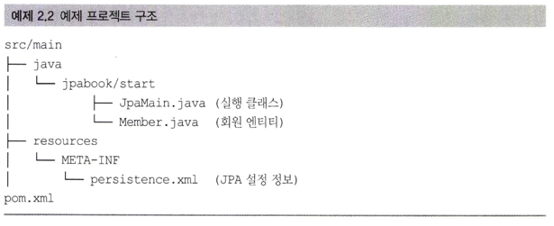
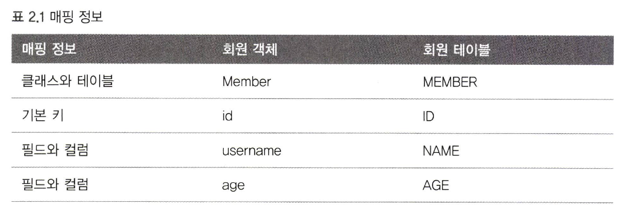
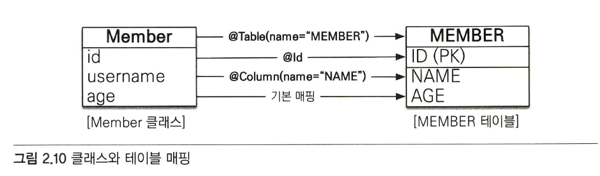
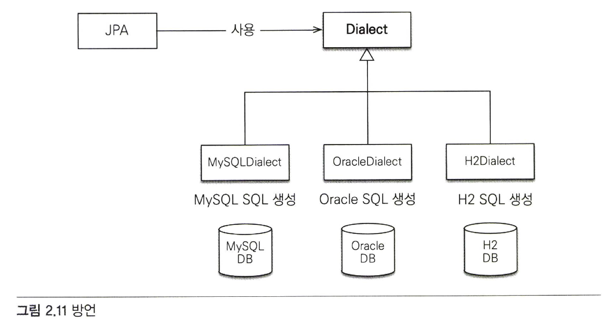
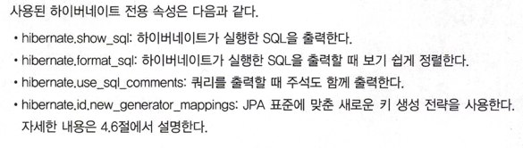
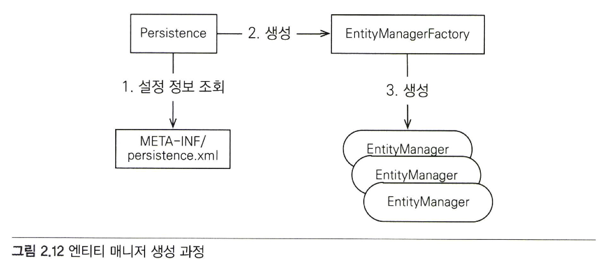

# 2.2 H2 DB 설치

http://www.h2database.com > ALL platforms > 1.4.187 버전 다운로드

혹은

https://www.h2database.com/h2-2015=04-10.zip

bin/h2.sh를 실행하면 H2 DB를 서버모드로 실행 가능하다. (윈도우는 h2.bat or h2w.bat을 실행)

> H2 DB는 JVM 메모리 안에서 실행되는 임베디드 모드와 실제 DB처럼 별도의 서버를 띄워서 동작하는 서버 모드가 있다.

H2를 서버모드로 실행 한 후, http://localhost:8082를 입력하면 H2 데이터베이스 콘솔이 나온다.

아래와 같이 입력 후 DB 연결을 실행한다.

> * 드라이버 클래스 : org.h2.Driver
> * JDBC URL : jdbc:h2:tcp://localhost/~/test
> * 사용자 명 : sa
> * 비밀번호 : 입력하지 않는다. (공백)

완료 되었으면 예제 테이블을 아래와 같이 생성한다.

~~~sql
CREATE TABLE MEMBER (
    ID VARCHAR(255) NOT NULL,
    NAME VARCHAR(255),
    AGE INTEGER NOT NULL,
    PRIMARY KEY (ID)
);
~~~

---

# 2.3 라이브러리와 프로젝트 구조
메이븐을 통해 필요한 의존성을 명세한다.

> 메이븐, 그레이들
> > 의존성 관리와 빌드 자동화 툴
> >
> > 의존성 관리 : 다른 코드나 라이브러리를 사용할 때, 편하게 불러올 수 있도록 하는 장치
> >
> > 빌드 자동화 : 컴파일, 테스트, 패키징, 배포, 의존성관리 등 자동으로 수행하게 하는 장 빌드 스크립트를 작성하여 실행
> >
> > pom.xml(maven), build.gradle(gradle)에 작성한다.

JPA 구현체로 hibernate를 사용하기 위한 의존성은 아래와 같다.
> hibernate-core : 하이버네이트 라이브러리
> 
> hibernate-entitiymanager: 하이버네이트가 JPA 구현체로 동작하도록 JPA 표준을 구현한 라이브러리
> 
> hibernate-jpa-2.1-api : JPA2.1 표준 API를 모아둔 라이브러리

---

프로젝트 구조

---

## 2.3.1 메이븐과 사용 라이브러리 관리
라이브러리 관리는 (의존성 관리) 메이븐을 통해 진행한다.

메이븐은 간단하게 라이브러리를 관리해주는 도구이며, pom.xml에 사용할 라이브러리를 명세하면 자동으로 다운로드 한다.

> 1. 라이브러리 관리 가능
> * 자바 어플리케이션을 개발하려면 jar 파일로 된 여러 라이브러리가 필요하다.
> * 원래 jar를 직접 다운로드 받아서 사용했다
> * maven, gradle을 사용하여 자동으로 다운로드 받는다. (pom.xml / build.gradle 에 명세)
> 
> 2. 빌드 기능
> * 과거 Ant를 사용하여 빌드 스크립트를 작성했다.
> * 어플리케이션의 빌드 표준 방법을 제공한다.

---

프로젝트의 pom.xml

~~~xml
<?xml version="1.0" encoding="UTF-8"?>
<project xmlns="http://maven.apache.org/POM/4.0.0" xmlns:xsi="http://www.w3.org/2001/XMLSchema-instance"
         xsi:schemaLocation="http://maven.apache.org/POM/4.0.0 http://maven.apache.org/xsd/maven-4.0.0.xsd">
    <modelVersion>4.0.0</modelVersion>

    <groupId>jpabook</groupId>
    <artifactId>ch02-jpa-start1</artifactId>
    <version>1.0-SNAPSHOT</version>

    <properties>

        <!-- 기본 설정 -->
        <java.version>1.6</java.version>
        <!-- 프로젝트 코드 인코딩 설정 -->
        <project.build.sourceEncoding>UTF-8</project.build.sourceEncoding>
        <project.reporting.outputEncoding>UTF-8</project.reporting.outputEncoding>

        <!-- JPA, 하이버네이트 버전 -->
        <hibernate.version>4.3.10.Final</hibernate.version>
        <!-- 데이터베이스 버전 -->
        <h2db.version>1.4.187</h2db.version>

    </properties>

    <dependencies>
        <!-- JPA, 하이버네이트 -->
        <dependency>
            <groupId>org.hibernate</groupId>
            <artifactId>hibernate-entitymanager</artifactId>
            <version>${hibernate.version}</version>
        </dependency>
        <!-- H2 데이터베이스 -->
        <dependency>
            <groupId>com.h2database</groupId>
            <artifactId>h2</artifactId>
            <version>${h2db.version}</version>
        </dependency>
    </dependencies>

    <build>
        <plugins>
            <plugin>
                <groupId>org.apache.maven.plugins</groupId>
                <artifactId>maven-compiler-plugin</artifactId>
                <version>3.1</version>
                <configuration>
                    <source>${java.version}</source>
                    <target>${java.version}</target>
                </configuration>
            </plugin>
        </plugins>
    </build>

</project>
~~~

<dependencies> 태그 안에 사용할 라이브러리를 지정한다.

groupId, artifactId, version을 적으면 필요한 jar 파일을 maven 저장소에서 내려받는다.

JPA에 하이버네이트 구현체를 사용하려면 핵심 라이브러리는 2가지 이다.

1. JPA, hibernate(hibernate-entitiymanager) : JPA 표준과 하이버네이트를 포함하는 라이브러리. 명세 시, 아래 두 라이브러리를 함께 다운로드
* hibernate-core.jar
* hibernate-jpa-2.1-api.jar

2. H2 DB : H2 DB에 접속해야 하므로 지정한다.

---

# 2.4 객체 매핑 시작
위 예제 대로 DB 테이블을 만들고, 아래 처럼 회원 클래스를 생성한다.

~~~java
package jpabook.start;

import javax.persistence.*;  //**

/**
 * User: HolyEyE
 * Date: 13. 5. 24. Time: 오후 7:43
 */
@Entity
@Table(name="MEMBER")
public class Member {

    @Id
    @Column(name = "ID")
    private String id;

    @Column(name = "NAME")
    private String username;

    private Integer age;

    public String getId() {
        return id;
    }

    public void setId(String id) {
        this.id = id;
    }

    public String getUsername() {
        return username;
    }

    public void setUsername(String username) {
        this.username = username;
    }

    public Integer getAge() {
        return age;
    }

    public void setAge(Integer age) {
        this.age = age;
    }
}
~~~

## @Entity
어노테이션이 선언된 클래스를 테이블과 매핑한다고 JPA 에게 알려준다.

이렇게 선언된 클래스를 엔티티 클래스라고 한다.

## @Table
어노테이션이 선언된 엔티티 클래스에 매핑할 테이블 정보를 알려준다.

name 속성을 사용하여 Member 엔티티 클래스를 Member 테이블에 매핑했다.

이를 생략하면 엔티티 클래스 이름을 테이블 이름과 매핑 시킨다. (더 정확히는 엔티티 이름을 사용하는데 이는 4.1 절에서 설명한다.)

## @Id
어노테이션이 선언된 엔티티 클래스의 필드를 테이블의 기본 키에 매핑한다.

여기서는 id 필드와 테이블의 기본 키 id를 매핑했다.

이를 식별자 필드라고 한다.

## @Column
어노테이션이 선언된 엔티티 클래스의 필드를 DB 테이블 필드와 매핑 한다.

없으면 클래스 맴버의 이름으로 매핑한다.

대소문자 구분 여부는 DB에 따라 다르다.

---

> 이렇게 매핑하여 JPA 에게 매핑 정보를 알려줬으므로 JPA는 테이블과 엔티티의 패러다임을 극복할 수 있다.

---

# 2.5 persistence.xml 설정
JPA를 실행하기 위한 기본 설정 파일인 persistence.xml을 작성한다.

META-INF/persistence.xml 클래스 경로에 있다면 JPA는 별도의 설정 없이 인식할 수 있다.

~~~xml
<?xml version="1.0" encoding="UTF-8"?>
<persistence xmlns="http://xmlns.jcp.org/xml/ns/persistence" version="2.1">

    <persistence-unit name="jpabook">

        <properties>

            <!-- 필수 속성 -->
            <property name="javax.persistence.jdbc.driver" value="org.h2.Driver"/>
            <property name="javax.persistence.jdbc.user" value="sa"/>
            <property name="javax.persistence.jdbc.password" value=""/>
            <property name="javax.persistence.jdbc.url" value="jdbc:h2:tcp://localhost/~/test"/>
            <property name="hibernate.dialect" value="org.hibernate.dialect.H2Dialect" />

            <!-- 옵션 -->
            <property name="hibernate.show_sql" value="true" />
            <property name="hibernate.format_sql" value="true" />
            <property name="hibernate.use_sql_comments" value="true" />
            <property name="hibernate.id.new_generator_mappings" value="true" />

            <!--<property name="hibernate.hbm2ddl.auto" value="create" />-->
        </properties>
    </persistence-unit>

</persistence>
~~~

---

~~~xml
<persistence xmlns="http://xmlns.jcp.org/xml/ns/persistence" version="2.1">
~~~
설정 파일은 persistence로 시작하고 이 곳에 XML 네임스페이스와 사용할 버전을 명세한다.

---

~~~xml
<persistence-unit name="jpabook">
~~~
JPA 설정은 영속성 유닛 이라는 것부터 시작하는데 일반적으로 연결할 DB 당 하나의 영속성 유닛을 등록한다.

> 영속성 : Persistence, 지속적으로 보존하고 유지하는 것을 뜻한다.

영속성 유닛 당 고유한 이름을 가져야 한다.

영속성 유닛의 내부 속성을 하나씩 살펴 본다.

* JPA 표준 속성
  * javax.persistence.jdbc.driver : JDBC 드라이버
  * javax.persistence.jdbc.user : 데이터 베이스 접속 아이디
  * javax.persistence.jdbc.password : 데이터베이스 접속 비밀번호
  * javax.persistence.jdbc.url : 데이터베이스 접속 URL

* 하이버네이트 속성
  * hibernate.dialect : 데이터베이스 방언 설정

이름이 javax.persistence로 시작하는 속성은 JPA 표준 속성이므로 특정 구현체에 종속되지 않고 hibernate는 종속된다.

---

## 2.5.1 데이터베이스 방언
JPA는 특정 DB에 종속되지 않지만 DB 마다 차이점이 있다.

* 데이터 타입 : 가변 문자 타입으로 MySQL은 varchar, 오라클은 varchar2를 사용한다.
* 함수 명 : 문자를 다루는 함수로 SQL 표준은 SUBSTRING() , 오라클은 SUBSTR()을 사용한다.
* 페이징 처리 : MySQL은 limit을 사용하지만 오라클은 ROWNUM을 사용한다.

이렇게 SQL 표준에서 벗어나거나 특정 DB의 고유 기능인 경우 JPA에서는 이를 방언이라고 한다. (dialect)

JPA는 DB의 손쉬운 교체를 위해서 방언을 제공한다.

개발자는 JPA가 제공하는 문법에 맞춰 JPA를 사용하면 되고, 특정 DB에 종속적인 기능은 방언이 처리해준다.

DB 방언을 설정하는 방법은 JPA에 표준화 되어있지 않다.

하이버네이트는 H2 / 오라클 / MySQL 등 다양한 DB 방언을 제공한다.

나머지 속성은 아래와 같다.

---

# 2.6 에플리케이션 개발

~~~java
public static void main(String[] args) {

        //엔티티 매니저 팩토리 생성
        EntityManagerFactory emf = Persistence.createEntityManagerFactory("jpabook");
        EntityManager em = emf.createEntityManager(); //엔티티 매니저 생성

        EntityTransaction tx = em.getTransaction(); //트랜잭션 기능 획득

        try {
            tx.begin(); //트랜잭션 시작
            logic(em);  //비즈니스 로직
            tx.commit();//트랜잭션 커밋

        } catch (Exception e) {
            e.printStackTrace();
            tx.rollback(); //트랜잭션 롤백
        } finally {
            em.close(); //엔티티 매니저 종료
        }

        emf.close(); //엔티티 매니저 팩토리 종료
    }
~~~

위 코드는 어플리케이션 시작 부분에 선언된 코드이며 크게 3 부분으로 나뉜다.

> * 엔티티 매니저 설정
> * 트랜잭션 관리
> * 비지니스 로직

---

## 2.6.1 엔티티 매니저 설정
엔티티 매니져의 생성 과정은 아래와 같다.

### 엔티티 매니저 팩토리 생성
JPA를 시작하려면 우선 persistence.xml의 설정 정보를 사용해서 엔티티 매니저 팩토리를 생성해야 한다.

이때 Persistence 클래스를 사용하여 엔티티 매니저 팩토리를 생성하도록 준비한다.

~~~java
//엔티티 매니저 팩토리 생성
EntityManagerFactory emf = Persistence.createEntityManagerFactory("jpabook");
~~~

이때 생성할 엔티티매니저팩토리는 영속성 유닛을 찾아서 생성한다.

생성 시, 구현체에 따라서 커넥션 풀도 생성하므로 생성 비용이 아주 크다.

그러므로 매번 생성하는 것이 아닌 딱 한번 생성해서 공유하여 사용해야한다.

---

### 엔티티 매니저 생성
~~~java
EntityManager em = emf.createEntityManager(); //엔티티 매니저 생성
~~~
JPA의 대부분 기능은 엔티티매니저가 제공한다. 대표적으로 CRUD를 한다.

엔티티 매니저는 내부에 테이터소스를 유지하면서 DB와 통신한다. 가상의 DB라고 생각하면 된다.

엔티티 매니저는 DB 커넥션과 밀접하므로 스레드간 공유하거나 재사용하면 안된다.

---

### 종료
사용이 끝난 엔티티 매니져는 종료해줘야 한다.

엔티티 매니저 팩토리도 함께 종료한다.

~~~java
em.close();
emf.close();
~~~

---

## 2.6.2 트랜젝션 관리
JPA를 사용하면 항상 트랜젝션 안에서 데이터를 변경해야 한다. 그렇지 않으면 예외가 발생한다.

트랜젝션은 엔티티 매니져에서 받아온다. 엔티티 매니저가 JPA에 대부분의 기능을 제공한다.

아래 코드를 보자. 

~~~java
EntityTransaction tx = em.getTransaction(); //트랜잭션 기능 획득

        try {
            tx.begin(); //트랜잭션 시작
            logic(em);  //비즈니스 로직
            tx.commit();//트랜잭션 커밋

        } catch (Exception e) {
            e.printStackTrace();
            tx.rollback(); //트랜잭션 롤백
        } finally {
            em.close(); //엔티티 매니저 종료
        }

        emf.close(); //엔티티 매니저 팩토리 종료
~~~
정상 적인 경우 커밋 / 예외 발생 시 롤백을 한다.

---

## 2.6.3 비지니스 로직
아래 코드를 보자

~~~java
public static void logic(EntityManager em) {

        String id = "id1";
        Member member = new Member();
        member.setId(id);
        member.setUsername("지한");
        member.setAge(2);

        //등록
        em.persist(member);

        //수정
        member.setAge(20);

        //한 건 조회
        Member findMember = em.find(Member.class, id);
        System.out.println("findMember=" + findMember.getUsername() + ", age=" + findMember.getAge());

        //목록 조회
        List<Member> members = em.createQuery("select m from Member m", Member.class).getResultList();
        System.out.println("members.size=" + members.size());

        //삭제
        em.remove(member);

    }
~~~

위에서 언급했던 것 처럼 CRUD를 엔티티매니저를 통해 실행한다.

### 등록
~~~java
String id = "id1";
Member member = new Member();
member.setId(id);
member.setUsername("지한");
member.setAge(2);

//등록
em.persist(member);
~~~
엔티티 생성 후, 엔티티 매니저의 persist 메서드를 통해 인자 값으로 엔티티 클래스의 인스턴스를 넘겨주면 된다.

JPA는 회원 엔티티 클래스의 어노테이션을 통해 매핑 정보를 분석하고 SQL을 생성하여 DB에 전달한다.

---

### 수정
~~~java
//수정
member.setAge(20);
~~~

JPA는 어떤 엔티티가 어떻게 수정되었는지에 대한 추적 기능을 가지고 있기 때문에 엔티티 값만 변경하면

업데이트 쿼리가 DB로 전달된다.

---

### 삭제
~~~java
//삭제
em.remove(member);
~~~
엔티티를 삭제하려면 엔티티매니저의 remove() 메서드를 호출하여 인자 값으로 엔티티 클래스를 넘겨주면 된다.

---

### 한 건 조회
~~~java
//한 건 조회
Member findMember = em.find(Member.class, id);
System.out.println("findMember=" + findMember.getUsername() + ", age=" + findMember.getAge());
~~~
엔티티 매니저의 find 메서드는 인자 값으로 조회할 엔티티 타입과 @Id가 선언된 필드 값으로 디비 기본키 컬럼과 값을 비교하여 

단일 엔티티를 조회하는 매서드이다.

---

### 다 건 조회
하나 이상의 회원 목록을 조회하는 코드를 보자

~~~java
//목록 조회
List<Member> members = em.createQuery("select m from Member m", Member.class).getResultList();
~~~
JPA를 사용하면 엔티티 중심으로 개발을 해야하고 DB는 JPA에게 위임해야 한다.

CRUD는 상관없지만 문제는 검색이다.

엔티티를 중심으로 개발 하므로, DB를 엔티티 (자바) 로 전부 로딩해서 필터를 해줘야 하는데 이는 성능 상 불가능하다.

필요한 데이터만 SQL로 불러오려면 SQL을 써야한다.

JPA는 JQPL로 이를 해결한다.

SQL과의 차이점은 아래와 같다.

> SQL은 디비 테이블을 대상으로 질의한다.
> JQPL은 엔티티 객체를 대상으로 쿼리한다. 즉, 클래스와 필드를 대상으로 쿼리한다.

위 코드에서 Member는 테이블이 아닌 엔티티 이며, JPQL은 전혀 DB를 알지 못한다.

> JQPL은 대소문자를 구분하는데 SQL은 잘 구분하지 않는다. 
> 
> 책에서는 SQL은 대문자만으로 , JPQL은 섞어서 사용한다.

---

# 2.7 정리
JPA를 사용하기 위한 환경 설정을 했고, JPA로 간단한 CRUD를 했다.

반복적으로 db와 커넥션을 만들어야 하는 JDBC API, 질의 결과를 클래스로 매핑해주는 코드가 없어서 개발이 빨라졌다.

---

# 생각해볼점
* 요즘은 스프링부트 + JPA를 사용하기 때문에 위 방법 말고도 더 손쉽거나 반대되는 방법으로 개발이 가능하다.
  * 검색 쿼리는 JPQL을 사용하지 않고도 가능하다. (ex, namedQuery, queryDSl 등...)
  * persistence.xml 없이도 spring boot는 jpa 기본 설정이 가능하다.
  * 그럼에도 기본을 알아야 활용을 하기 쉽고 흔들리지 않게 된다.

* 트랜젝션 역시 엔티티매니저로부터 받아오는 방식이 아닌 @Transactional 어노테이션으로도 가능하다.
  * spring core > tx 에서 제공
* 동적으로 SQL을 생성해야 할 때는 어떻게 해야 하는가...
  * 동적으로 조건문을 추가 한다거나.. 등등의 경우

