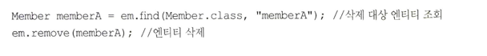

엔티티 매니저는 이름 그대로 엔티티에 관리자 이다.

엔티티의 CRUD는 기본으로 제공하며, 가상의 DB라고 생각하면 된다.

아래 내용은 하이버네이트 구현체를 기준으로 작성되었다.

---
# 3.1 엔티티 매니저 팩토리와 엔티티 매니저
2장에서 엔티티 매니저 팩토리는 영속성 유닛 당 하나씩 생성한다고 했다.

다음은 엔티티 매니저 팩토리를 생성하는 코드이다.

~~~java
//공 장 만들기 , 비용이 아주 많이 든다.
EntityManagerFactory emf =
Persistence.createEntityManagerFactory("jpabook");
~~~
위 코드 실행 시, persistence.xml를 참조하여 엔티티 매니저 팩토리를 생성한다.

이제 필요한 경우 엔티티 매니저를 생성하여 사용하면 된다.

~~~java
EntityManager em = enf.createEntityManager();
~~~
엔티티 매니저 팩토리는 스레드에 안전하므로 동시에 여러 스레드가 접근해도 괜찮지만,

엔티티 매니저는 여러 스레드에서 동시에 접근하면 동시성 문제가 발생하므로 스레드간에 절대 공유해선 안된다.

그림을 보면 엔티티 매니저 팩토리 한 개에서 2개의 엔티티 매니저를 생성하여 사용한다.

1은 아직 DB 커넥션을 사용하지 않았는데 2는 사용한다.

JPA는 DB 연결이 필요한 시점 (트렌젝션 시작) 시까지 커넥션을 얻지 않는다.

엔티티 매니저 팩토리는 생성 시, 디비 커넥션 풀도 함께 생성한다.

---

# 3.2 영속성 컨텍스트란 ?
엔티티를 영구 저장하는 환경이란 뜻이다.
엔티티 매니저로 엔티티를 조작하면 엔티티 매니저는 영속성 컨텍스트에 엔티티를 보관 하고 관리한다.

영속성 컨텍스트는 데이터베이스에서 가져온 데이터를 메모리에 유지하고,
변경된 데이터를 추적하여 데이터베이스에 반영하는 일종의 작업 영역을 나타낸다.

영속성 컨텍스트는 엔티티 매니저당 생성되고, 엔티티 매니저를 통해 접근 가능하다.

> 사실 단일 영속성 컨텍스트에 여러 엔티티 매니저가 접근 할 수 있지만 1:1 이라고 생각하고 넘어간다. 11장에서 설명한다.

---

# 3.3 엔티티의 생명주기
엔티티에는 4가지 상태가 존재한다.

> * 비영속 : 영속성 컨텍스트와 아무런 관계가 없는 상태 (new / transient)
> * 영속 : 영속성 컨텍스트에 저장된 상태 (managed)
> * 준영속 : 저장되었다가 분리된 상태 (detached)
> * 삭제 : 삭제된 상태 (removed).

## 비영속
엔티티 객체를 생성하고 엔티티 매니저를 통해 persist 하지 않은 상태이다.

---

## 영속
엔티티 매니저를 통해 persist() 메서드를 호출하여 영속성 컨텍스트에 저장된 상태이다.

영속성 컨텍스트에 의해 관리되는 상태이며, 엔티티 매니저를 통한 find() 메서드나, jpql을 통한 조회 상태도 영속성 컨텍스트가 관리하므로

영속 상태라고 할 수 있다.

---

## 준영속
엔티티 매니저에의해 영속되었거나, 조회되어서 디비에서 가져와서 메모리에 유지되고 있는 데이터가 영속성 컨텍스트에서 벗어난 상태이다.

엔티티 매니저의 detach 나, 엔티티 매니저 자체가 close() 된다면 관리하던 엔티티는 준영속 상태가 된다. (비영속)

---

## 삭제
엔티티 매니저를 통해 삭제된상태이고, 영속성 컨텍스트와 DB에서 삭제된다.

---

비영속은 DB랑 아무 상관이 없는 것이고, 준영속은 영속성 상태를 벗어났기 때문에 수정되거나 삭제되어도 DB에 반영되지 않는다.

---

# 3.4 영속성 컨텍스트의 특징

## 영속성 컨텍스트와 식별자 값
영속성 컨텍스트는 엔티티를 식별자 값으로 구분한다. 따라서 영속 상태는 반드시 식별자 값이 있어야 한다.

그렇지 않으면 예외가 발생한다.

---

## 영속성 컨텍스트와 디비 저장
영속성 컨텍스트에 연티티를 저장하면 언제 디비에 저장될까?

트랜젝션이 커밋하는 순간 영속성 컨텍스트에 새로 저장(수정)된 데이터가 디비에 반영되는데 이를 플러시라고 한다.

---

## 영속성 컨텍스트가 엔티티를 관리하면 주는 장점
* 1차 캐시
* 동일성 보장
* 트랜젝션을 지원하는 쓰기 지연
* 변경 감지
* 지연 로딩

---

## 3.4.1 엔티티 조회
영속성 컨텍스트는 내부에 캐시를 가지고 있는데 이를 1차 캐시라고 한다.

영속 상태의 모든 엔티티는 1차 캐시에 저장된다.

persist() 메서드로 영속성 컨텍스트에 저장하면 아래 그림 처럼 된다.

영속성 컨텍스트에 1차 캐시는 맵으로 이해하면 되고 키는 엔티티의 식별자 이고, 값은 엔티티이다.

find() 나 jpql을 통해 1차 캐시에 있는 엔티티를 조회 한 경우, 캐싱된 데이터가 오며, DB를 조회하지 않는다.

없으면 조회 한 후, 1차 캐시에 저장하고 반환한다.

---

### 영속 상태의 엔티티의 동일성 보장
영속성 상태에서 1차 캐시에 있다면, 재 조회 시 캐싱된 데이터를 반환하기 때문에

a == b 의 비교를 통해서도 참을 반환한다.

> JPA는 1차 캐시를 통해 반복 가능한 읽기 (repeatable read) (isolation level의 일부) 를 디비가 아닌 애플리케이션 레벨에서 제공한다.
---

## 3.4.2 엔티티 등록
아래 코드를 보며 엔티티 등록을 보자

엔티티 매니저는 트랜젝션을 커밋하기 전까지 디비에 플러시를 하지 않고 insert sql을 내부에 sql 저장소에 모아둔다.

그리고 커밋 시, sql 저장소에 있는 쿼리를 db에 보내는데, 이를 쓰기 지연이라고 한다.

그림으로 보자

구체적으로 말하면 트랜젝션이 커밋될 때 영속성 컨텍스트가 플러시 되고, 이후에 변경 내용을 디비에 동기화 작업을 한다.

(SQL 저장소에 쌓인 쿼리를 전송한다.)

이후 디비를 커밋한다.

---

### 트랜젝션을 지원하는 쓰기 지연이 가능한 이유
트랜젝션 안에서 실행되므로 디비 커밋과 롤백은 결국 일괄로 이뤄진다.

그러므로 하나하나 커밋을 하던, 모아서 커밋을 하던, 트랜젝션이 종료되는 시점에서 모든 작업이 디비에 반영되고, 디비 커밋 직전에만

쿼리를 모두 보내면 결과가 동일해진다. 이것이 트랜젝션을 지원하는 쓰기 지연이 가능한 이유이다.

---

## 3.4.3 엔티티 수정
### SQL 수정 쿼리의 문제점
기존 어플리케이션이 SQL을 직접 조작해서 엔티티를 수정했을 때는 실수가 잦아지고, SQL을 계속 확인하고 양산해야 로직 수정이 가능했다

---

### 변경 감지
JPA는 어떨까?

아래 예제를 보자.

JPA는 조회된 엔티티를 수정하기만 하면 디비에 반영이 된다.

update() 같은 메서드를 실행해야 할 것 같지만 그렇지 않다.

이렇게 엔티티의 변경사항을 데이터베이스에 자동으로 반영하는 기능을 변경 감지 (dirty-checking)이라고 한다.

JPA는 영속성 컨텍스트에 엔티티를 저장할 때 최초 상태를 복사해 두는데 이를 스냅샷이라고 한다.

그리고 플러시(영속성 컨텍스트에 추가, 수정된 내용을 디비에 반영) 시점에 스냅샷과 엔티티의 상태를 비교하여 변경사항을 찾는다.

1. 트랜젝션 커밋 시, 엔티티 매니져 내부에서 플러시를 호출한다.
2. 스냅샷과 엔티티의 상태를 비교하여 변경된 엔티티를 찾는다.
3. 쓰기 지연 SQL 저장소에 변경사항을 반영할 수정 쿼리를 보낸다.
4. 쓰기지연 SQL 저장소를 DB에 보낸다.
5. 디비 커밋을 한다.

더티체킹은 영속 상태에 엔티티에 대해서만 해당된다.

생성되는 SQL은 변경된 필드가 아닌 모든 필드에 대해서 이뤄진다. 왤까?

1. 수정 쿼리가 항상 동일해서 미리 만들어놓고 재사용할 수 있다.
2. DB에 동일한 쿼리를 보내면 한 번 파싱된 쿼리를 재사용할 수 있다.

같은 말 같다. 필드가 너무 많거나 저장되는 내용이 너무 크면 수정된 내용만 동적으로 생성하는 전략을 쓰면 된다.

이는 하이버네이트의 확장 기능을 사용해야 한다.

이렇게 어노테이션을 선언하여 사용하면 수정된 데이터만 사용해서 Update SQL을 생성한다.

참고로, 데이터 저장 시, null 이 아닌 존재하는 데이터만으로 insert SQL을 동적으로 생성하는

@DynamicInsert도 지원한다.

> 컬럼이 30개 이상되면 다이나믹업데이트가 더 빠르다고 한다.

---

## 3.4.4 엔티티 삭제
엔티티를 삭제하려면 우선 조회해야 한다.

엔티티 매니저에게 삭제할 엔티티를 전달하면 되는데, 삭제 역시 즉시 반영되지 않고 쓰기 지연을통해

트랜젝션이 커밋될 때 디비에서 삭제된다.

애플리케이션에서 삭제 시, 쓰기지연SQL저장소에 보내지고, 트랜젝션이 커밋될 때 플러시가 호출되면

실제 데이터베이스에서 삭제 쿼리를 전달한다.

---

# 3.5 플러시
플러시는 영속성 컨텍스트의 변경 내용을 데이터베이스에 반영한다.

플러시를 실행하면 아래와 같은 일이 일어난다.

1. 변경 감지가 동작해서영속성 컨텍스트에 있는 모든 엔티티의 스냅샷과 상태를 비교해서 수정된 엔티티를 찾는다. 수정된 내용은 쓰기 지연 SQL 저장소로 간다.
2. 쓰기 지연 SQL저장소에 있는 쿼리를 DB에 보낸다.

영속성 컨텍스트를 플러시 하는 방법은 3가지 이다.

1. em.flush()로 엔티티 매니저를 통해 호출한다.
* 엔티티 매니저의 flush 메서드를 직접 호출해서 영속성 컨텍스트를 강제로 플러시 할 수 있다. 거의 사용하지 않는다.
* 테스트나 다른 프레임워크와 JPA를 함께 쓰는 경우 사용하기도 한다.

2. 트랜젝션이 커밋되는 순간 플러시가 호출된다.
* 변경사항을 SQL로 바꿔 전달하지 않고, 트랜젝션만 커밋하면 어떤 데이터도 디비에 반영되지 않는다.
* 따라서 트랜젝션 커밋 전에 꼭 플러시를 호출하여 영속성 컨텍스트에 스냅샷과 엔티티의 상태를 비교해야 한다.
* 비교해서 차이점을 SQL로 작성하여 쓰기지연SQL저장소에 보내고 DB에 보내야 한다.

3. JPQL 쿼리 호출 시 플러시가 호출된다.
* JPQL 이나 criteria(10장 설명) 같은 객체지향 쿼리를 호출할 때도 실행된다. 왜 그럴까?

먼저 em.persist()를 호출해서 엔티티 a,b,c를 영속 상태로 만들었다.

얘들은 아직 디비에 없다.

이때 jpql을 실행하면 sql로 변환되어 DB에서 엔티티를 조회한다. (????)

근데 디비에는 아직 없으므로 쿼리 결과로 조회되지 않는다. 따라서 쿼리를 실행하기 직전에 영속성 컨텍스트를 플러시하여

변경 내용을 디비에 반영한다.

---

## 3.5.1 플러시 모드 옵션
엔티티 매니저에 플러시 모드를 직접 지정하려면 javax.persistence.FlushModeType을 사용하면 된다.
1. FlushModeType.AUTO : 커밋이나 쿼리를 실행할 때 플러시 (기본 값)
2. FlushModeType.COMMIT : 커밋할 때만 플러시

---

플러시라는 이름은 영속성 컨텍스트와 디비의 동기화를 뜻하지 영속성 컨텍스트를 비운다고 생각하면안된다.

그리고 디비와의 동기화를 늦출 수 있는 이유는 트랜젝션이라는 작업 단위가 있기 때문이고, 트랜젝션 종료 이후 디비 커밋 전까지만

변경사항을 디비에 동기화 하면 된다.

---

# 3.6 병합
병합은 준영속，비영속을 신경 쓰지 않는다. 식별자 값으로 엔티티를 조회할 수

있으면 불러서 병합하고 조회할 수 없으면 새로 생성해서 병합한다. 따라서 병합은

save or update 기능을 수행한다.

---

# 질문
* 트랜젝션 격리 수준 (lsolation level)

* em.persist를 하면 영속성 컨텍스트 안에 1차 캐시에 엔티티가 저장되는데, jpql 쿼리를 호출할 때도 1차 캐시에서 우선 조회를 하는데 왜 플러시를 자동으로 
* 호출하고 지랄일까 씨발롬이 
* -> 이해가 안가네 1차 캐시에서 조회 안하는것도 이해가 안가고... 왜 플러시를 호출할까... 
* -> 결국에는 디비 커밋과는 다른 개념이고 JPQL 실행 전에 플러시가 일어나는건 성능 이슈로 1차 캐시와 디비를 동기화 시키는 개념이라고 생각.

