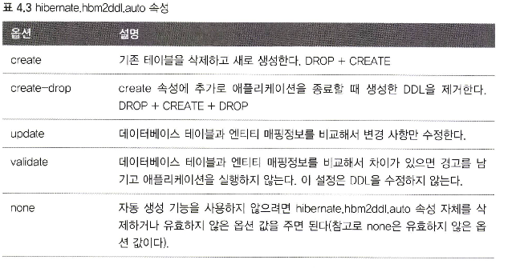

JPA를 사용할 때 엔티티 클래스에 어노테이션을 통해 DB 테이블과 엔티티를 매핑하는 정보를 제공해주는 것은 중요하다.

> JPA에게 제공할 매핑 정보는 XML이나 어노테이션 중에 선택하여 기술하면 되는데 에노테이션을 사용하는 쪽이 더 쉽고 직관적이다.

# 4.1 @Entity
JPA를 통해 매핑 정보를 제공할 클레스는 필수적으로 @Entitiy 어노테이션을 붙여야 한다. @Entity가 붙은 클래스를 엔티티라고 하며 JPA가 관리한다.

name 속성은 엔티티의 이름을 지정하며 중복되면 안되고, 설정하지 않으면 클래스의 이름을 그대로 사용한다.

> 주의 사항
> > * 기본 생성자는 필수이다. (public / protected)
> > * final, interface, inner 클래스에는 사용할 수 없다.
> > * 저장할 필드에 final을 붙이면 안된다.

---

# 4.2 @Table
@Table 어노테이션은 엔티티와 매핑할 테이블 정보를 기술한다. 생략하면 엔티티 명을 테이블 명과 매핑한다.

---

# 4.3 다양한 매핑 사용
아래 요구사항을 만족하는 코드를 우선 보자

* 회원은 일반 회원과 관리자로 구분된다.
* 회원 가입일은 수정일이 있어야 한다.
* 회원을 설명할 수 있는 필드가 있어야 한다. 길이 제한이 없는 필드이다.

~~~java
@Entity
@Table(name="MEMBER")
public class Member {
    @Id
    @Column(name = "ID")
    private String id;
    
    private String userName;
    
    private Integer age;
    
    @Enumerated(EnumType.STRING)
    private RoleType roleType;
    
    private Date createdDate;
    
    @Temporal(TemporalType.TIMESTAMP)
    private Date lastModifiedDate;
    
    @Lob
    private String description;
}

public class RoleType {
    ADMIN, USER
}
~~~

위 코드를 분석해본다.

1. roleType : 자바 enum 클래스를 사용하려면 @Enumerated 어노테이션으로 매핑해야 한다.
2. 자바 날짜 타입은 @Temporal을 사용해서 매핑한다.
3. 길이 제한이 없는 타입은 DB에서 varchar 대신 CLOB을 지정한다.

---

# 4.4 데이터베이스 스키마 자동 생성
JPA는 DB 스키마를 자동으로 생성하는 기능을 제공한다. 엔티티 클래스의 어노테이션을 통해 매핑 정보를 알아낸다.

스키마 자동 생성 기능을 사용하려면 persistence.xml에 아래 코드를 추가한다.

~~~
<property name="hibernate.hbm2ddl.auto" value="create" />
~~~

위 코드는 어플리케이션 실행 시점에 DB 테이블을 자동 생성한다.

~~~
〈property name="hibernate.show_sql" value="true" />
~~~

위 코드를 통해 SQL을 콘솔에 출력한다.

속성 추가 후 어플리케이션 시작 시, 위 처럼 생성 쿼리가 출력된다.

운영에서 사용하면 큰일난다. 위 태그의 속성을 아래 기술한다.

---

# 이름 매핑 전략 변경하기

자바에서는 관례로 카멜 표기법을 사용한다. 하지만 DB는 주로 관례적으로 언더스코어를 사용한다.

따라서 아래 코드 처럼 컬럼 명을 제공해줘야 한다.

~~~
@Column(name="role_type")
String roleType
~~~

아래 속성을 통해 이름 매핑 전략을 변경할 수 있다. 속성 값 지정에 따라 테이블, 컬럼 명을 제공하는 어노테이션 속성 값이 생략되면

자바의 카멜 표기법을 언더스코어 표기법으로 매핑한다.

~~~
<property name="hibernate.ejb.naming_strategy" value="org.hibernate.cfg.ImprovedNamingStrategy" />
~~~

---

# 4.5 DDL 생성 기능
회원 이름은 필수이고, 10자를 초과하면 안된다는 제약조건을 추가해보자

~~~java
@Entity
@Table(name="MEMBER")
public class Member {
    @Id
    @Column(name = "ID")
    private String id;

    // 추가됨
    @Column(name = "NAME", nullable = false, length = 10) 
    private String userName;
}
~~~

@Column 어노테이션 속성에 nullable을 false로 주면 DDL 생성 시, not null 제약 조건을 추가할 수 있다.

그리고 length를 지정하면 문자의 크기를 지정할 수 있다. 아래는 생성된 SQL 이다.

유니크 제약조건도 설정할 수 있다.

~~~java
@Entity
// 추가
@Table(name="MEMBER", uniqueConstratints = {
        @UniqueConstraint(
                name = "NAME_AGE_UNIQUE",
                colunNames = {
                        "NAME",
                        "AGE"
                }
        )
})
public class Member {
    @Id
    @Column(name = "ID")
    private String id;

    // 추가됨
    @Column(name = "NAME", nullable = false, length = 10) 
    private String userName;
}
~~~

위 기술한 속성들은 DDL 시에만 사용되고 JPA로직에는 영향을 주지 않지만 기술해놓으면 엔티티만 보고도 테이블의 제약조건 등을 확인할 수 있다.

---

# 4.6 기본 키 매핑

~~~java
@Entity
@Table(name="MEMBER")
public class Member {
    @Id
    @Column(name = "ID")
    private String id;

    // 추가됨
    @Column(name = "NAME", nullable = false, length = 10)
    private String userName;
}
~~~

엔티티에 @Id로 매핑된 필드는 테이블의 기본 키를 나타낸다. 직접 키 값을 지정하지 않고 DB가 생성해주는 값을 쓰려면 어떻게 해야 할까?

JPA가 제공하는 기본키 생성 전략은 아래와 같다.

1. 직접 할당 : 어플리케이션에서 만들어서 넣는다.
2. 자동 생성 : 대리 키 사용 방식
   1. IDENTITY : 기본 키 생성을 DB에게 위임한다.
   2. SEQUENCE : DB 시퀸스를 사용해서 기본 키를 할당한다.
   3. TABLE : 키 생성 테이블을 사용한다.

DB마다 지원하는 방식이 다르기 때문에 자동 생성 전략은 다양하다. 예를 들어 오라클에서는 시퀸스를 제공하지만 MySQL 에서는 AUTO_INCREMENT를 제공한다.

TABLE 전략은 키 생성용 테이블을 만들고 시퀸스 처럼 사용한다. 이 전략은 모든 DB에서 사용 가능하다.

직접 할당하려면 @Id 만 있으면 되고, 자동 할당을 하려면 키 필드 위에 @GeneratedValue 속성과 전략 값을 추가해준다.

해당 기능은 호환성 이슈로 인해 false 값을 기본으로 갖는 아래 속성을 지정해야만 활성화 된다.

~~~
<property name="hibernate.id.new_generator_mappings" value="true" />
~~~

---

## 4.6.1 기본 키 직접 할당 전략
@Id 어노테이션만 달아주면 된다.

@Id를 적용 가능한 자바 타입은 아래와 같다.

1. primitiveType
   2. 
2. String
3. java.util.Date
4. java.sql.Date
5. java.Math.BigDecimal
6. java.math.BigInteger

기본 키 직접 할당 전략은 엔티티를 영속화 하기 전에 어플리케이션에서 기본 키를 직접 할당하는 방법이다.

~~~
Board board = new Board();

board.setId(1);

em.persiste(board);
~~~

---

## 4.6.2 IDENTITY 전략
Identity 전략은 기본 키 생성을 DB에 위임하는 전략이며, MySql의 AUTO_INCREMENT 기능은 DB 키를 자동 생성해준다.

아래 예제를 보자

위 전략을 사용하면 어플리케이션에서는 영속화 이후에 기본 키 값을 알 수 있다.

이 경우에는 @GeneratedValue 어노테이션을 기본 키 필드에 추가해주고 생성 전략을 지정해줘야 한다.

위 코드에서 em.persist()를 호출한 이후 할당된 식별자 값을 호출했다.

출력된 값은 저장 시점에 DB가 생성한 값을 JPA가 초기화 한 것이다.

> Identity 전략은 데이터를 DB에 insert 한 후에 기본 키를 조회할 수 있다.
> 
> 따라서 식별자 값을 할당하려면 추가로 DB를 조회해야  한다. (식별자 값 조회)
> 
> JDBC3에 추가된 Statement.getGeratedKeys()를 사용하면 데이터 저장과 동시에 생성된 기본 키 값을 얻어올 수 있으며
> 
> 하이버네이트는 이 메서드를 사용하여 DB와 한 번의 통신으로 저장과 조회를 한다. (쿼리 안나감)

> 주의점이 있다. 엔티티가 영속 상태가 되려면 반드시 식별자가 필요하기 때문에 Identity 전략을 사용하면 em.persist()를 호출하는 순간
> 
> 엔티티를 DB에 저장해야 식별자가 나오므로 즉시 INSERT SQL이 DB로 전달된다. 그러므로 트렌잭션을 지원하는 쓰기 지연이 동작하지 않는다. (바로 SQL나감)

---

# 4.6.3 SEQUENCE 전략
SEQUENCE는 오라클, PostgreSQL 등에서 제공한다.

~~~java
@Entity
@SequenceGenerator (
        name = "BOARD_SEQ_GENERATOR",
        sequenceName = "BOARD_SEQ", // 매핑할 데이터베이스 스퀸스 이름
        initialValue = 1,
        allocationSize = 1
)
public class Board {
    @Id
    @GeneratedValue(
            strategy = GenerationType.SEQUENCE,
            generator = "BOARD_SEQ_GENERATOR"
    )
    private Long id;
}
~~~

동작 방식은 Identity와 조금 다르다.

em.persist()를 호출할때 DB의 시퀸스를 우선 조회하고 엔티티에 할당한 후에 영속성 컨텍스트에 저장한다.

이후에 트랜젝션 커밋 시, 플러시가 일어나면 엔티티를 DB에 저장한다.

---

---

## 4.6.5 AUTO 전략
@GeneratedValue 에노테이션의 속성 값을 AUTO로 지정하면 DB에 따라 IDENTITY, SEQUENCE, TABLE 중 하나를 선택한다.

이렇게 되면 DB를 바꿔도 코드를 수정할 필요가 없다.

그런데 전략이 SEQUENCE, TABLE로 지정되면 시퀸스나 키 생성용 테이블을 미리 만들어놔야 한다.

스키마 자동 생성 기능이 있으면 알아서 만들어준다.

---

## 4.6.6 기본 키 매핑 정리
영속성 컨텍스트는 엔티티를 식별자 값으로 구분하기 때문에 엔티티를 영속화 하려면 식별자 값이 반드시 있어야 한다.

각 기본 키 매핑 전략에 따른 로직은 아래와 같다.

1. 직접 할당 : em.persist()를 호출하기 전에 어플리케이션에서 직접 할당해서 넣는다.
2. SEQUENCE : DB 시퀸스를 획득한 후에 영속성 컨텍스트에 저장한다.
3. TABLE : 시퀸스 생성용 테이블에서 식별자 값을 획득한 후에 영속성 컨텍스트에 저장한다.
4. IDENTITY : DB에 엔티티를 저장해서 식별자 값을 가져온 후에 영속성 컨텍스트에 저장한다.
   5. 트랜젝션을 지연하는 쓰기지연 지원 불가.
   6. JPA에서 저장 후, 값을 불러올 때 추가적인 SQL은 호출하지 않는다. (조회를 위한 추가적인 SQL)

    

---

# 4.7 필드와 컬럼 매핑 : 레퍼런스

---

## 4.7.1 @Column
@Column 어노테이션은 필드 위에 서술하며, 테이블 컬럼과 필드를 매핑하는 정보를 제공한다.

속성 중, insertable, updatable 속성은 디비에 저장되어 있는 정보를 읽기만 하고 변경하는 것을 방지할때 사용한다.

---

## 4.7.2 @Enumerated

자바의 Enum 타입을 매핑할 때 사용한다.

> EnumType.ORDINAL은 enum에 정의된 순서대로 0부터 속성 값을 매핑한다.
> 
> 장점 : DB에 저장되는 크기가 작다.
> 
> 단점 : 이미 저장된 ENUM의 순서를 변경할 수 없다.

> EnumType.STRING은 enum의 이름 그대로를 저장한다.
> 
> 장점 : 순서가 저장되거나 값이 추가되어도 안전하다.
> 단점 : DB에 비교되는 크기가 ORDINAl에 비해 크다.

---

## 4.7.3 @Temporal
자바 1.8 이상부터는 사용하지 않고 자바 8에 추가된 LocalDateTime / LocalDate를 사용하면 하이버네이트가 자동으로 매핑한다.

---

## 4.7.4 @Lob
디비 BLOB/CLOB과 매핑한다.

문자인 경우 CLOB 이외에는 BLOB과 매핑한다.

---

## 4.7.5 @Transient
해당 어노테이션이 선언된 필드는 매핑하지 않는다. 따라서 데이터베이스에 저장하고 조회하지도 않는다.

임시로 어떤 값을 보관하고싶을때 사용한다.

~~~
@Transient
private Integer temp;
~~~

---

## 4.7.6 @Access
JPA가 엔티티에 접근하는 방식을 지정한다.

* 필드접근 : AccessType.FIELD로 지정한다. 필드에 직접 접근한다. 필드 권한이 private이어도 접근할 수 있다. 자바의 리플렉션을 사용한다.
* 프로퍼티 접근 : AccessType.PROPERTY로 지정한다. 접근자 getter를 사용한다.

예를 들어 @Access(AccessType.FILED) 어노테이션을 클래스에 넣는다면 JPA는 필드를 통해 테이블 컬럼과 클래스 맴버를 매핑한다.

반대로 @Access(AccessType.PROPERTY) 로 지정한다면 JPA는 테이블 컬럼과 매핑할 맴버변수를 Getter / Setter룰 통해 찾는다.

---

# 질문
1. java reflection
자바 리플렉션(Reflection)은 런타임 시에 클래스의 정보를 분석하고, 객체의 속성, 메서드, 생성자 등에 접근할 수 있는 기능을 말합니다.
 
리플렉션은 자바 프로그램에서 클래스를 동적으로 로드하고, 인스턴스를 생성하며, 메서드를 호출하는 등의 작업을 가능하게 합니다.

리플렉션은 편리하고 동적인 기능을 제공하지만, 성능 상의 비용이 있습니다. 일반적으로 리플렉션을 사용하면 컴파일러의 최적화가 불가능하고,

실행 시에 타입 체크 및 오류 검사가 이루어지므로 일반적인 메서드 호출보다 느릴 수 있습니다. 또한, 메서드 호출 시에는 일반적인 메서드 호출보다 오버헤드가

크기 때문에 성능이 저하될 수 있습니다.

정적 바인딩(Static Binding)이 불가능: 일반적인 경우에는 컴파일러가 정적으로 클래스와 메서드를 바인딩합니다. 이렇게 하면 컴파일러가 코드를 보다 

효율적으로 최적화할 수 있습니다. 하지만 리플렉션에서는 런타임에 클래스와 메서드가 결정되므로 정적 바인딩을 사용할 수 없습니다.

타입 안정성(Type Safety)의 부족: 리플렉션은 동적으로 타입을 결정하므로 컴파일러가 코드의 타입을 검사하고 오류를 찾는 데 도움이 되는

타입 안정성(Type Safety)이 보장되지 않습니다. 따라서 컴파일러가 타입 관련 최적화를 수행하기 어렵습니다.

메서드 호출 오버헤드: 리플렉션을 사용하여 메서드를 호출할 때는 일반적인 메서드 호출보다 오버헤드가 큽니다.

이는 메서드 호출 시에 메서드 시그니처를 검사하고 호출하는 과정이 추가되기 때문입니다.

보안 문제: 리플렉션을 통해 private이나 protected로 선언된 메서드에 접근할 수 있으므로, 이를 통한 보안 문제가 발생할 수 있습니다.

이러한 보안적인 측면에서도 리플렉션은 주의가 필요합니다.

