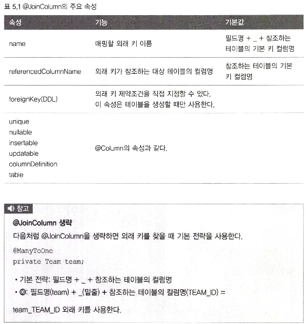

# 5.1 단방향 연관관계
회원과 팀의 관계에 대해 다대일 단방향 관계를 알아보자.

1. 회원과 팀이 있다.
2. 회원은 하나의 팀에만 소속될 수 있다.
3. 회원과 팀은 다대일 관계이다.

위 그림을 분석해본다.

1. 객체 연관관계
* 회원 객체는 Member.team 필드로 팀 객체와 연관관계를 맺는다.
* 회원 객체에서는 팀 객체 레퍼런스를 통해 접근이 가능하지만 팀은 그렇지 않다. 단방향 관계이다.

2. 테이블 연관관계
* 회원 테이블은 TEAM_ID 외래키로 팀 테이블과 연관관계를 맺는다.
* 각 테이블은 외래키를 통해 서로 JOIN을 통해 접근이 가능하다.

> 객체와 테이블 연관관계의 가장 큰 차이
> 
> * 객체는 참조를 통해 단방향으로 참조할 수 있다.
> * 테이블은 양방향으로 외래키를 통해 참조가 가능하다.

---

## 5.1.1 순수한 객체 연관관계
JPA 순수한 회원과 팀 클래스 코드를 보자.

~~~java
public class Member {
    private String id;
    private String userName;
    
    private Team team; // 팀의 참조
    
    public void setTeam(Team team) {
        this.team = team;
    }
}

public class Team {
    private String id;
    private String name;
}
~~~

회원 1과 회원 2를 팀에 소속 시켜보자.

~~~java
public static void main(String[] args) {
    Member member1 = new Member("1", "회원1");
    Member member1 = new Member("1", "회원1");
    Team team1 = new Team("1", "팀1");
    
    member1.setTeam(team);
    member2.setTeam(team);
    
    Team findTeam = member1.getTeam();
}
~~~

---

## 5.1.3 객체 관계 매핑
이제 JPA를 통해 둘의 관계를 매핑해보자.

~~~java
@Entity
public class Member {
    @Id
    @Column(name="MEMBER_ID")
    private String id;
    
    private String userName;
    
    // 연관관계 매핑
    @ManyToOne
    @JoinColumn(name="TEAM_ID")
    private Team team;
    
    public void setTeam(Team team) {
        this.team = team;
    }
}
~~~

순수 자바 객체로 설계한 것과 차이점은 Team에 대한 FK를 가지고 있는게 아니고 레퍼런스를 가지고 있다는 점이다.

그래고 연관관계 정보를 JPA에게 제공하기위해 @ManyToOne과 JoinColumn 이라는 어노테이션을 추가했다.

어노테이션에 대해 알아보자.

* @ManyToOne

이름 그대로 다대일 관계라는 매핑 정보이다.

* @JoinColumn(name="TEAM_ID")
조인 컬럼은 외래 키를 매핑할때 사용한다. 이 어노테이션은 생략가능하지만 특정 규칙이 있다. 아래 속성을 더 참고해보자.

---

## 5.1.4 @JoinColumn

---

## 5.1.5 @ManyToOne

---

# 5.2 연관관계 사용

## 5.2.1 저장
다대일로 연관관계 정보를 어노테이션을 통해 제공한 팀과 회원의 저장에 대한 코드를 알아보자.

~~~java
public void testSave() {
    
    // 팀 1 저장
        Team team1 = new Team("1", "1");
        em.persist(team1);
        
        // 회원 1 저장
        Member member1 = new Membe("1","1");
        member1.setTeam(team1);
        em.persist(member1);
        
        // 회원 2 저장
        Member member2 = new Membe("2","2");
        member2.setTeam(team1);
        em.persist(member2);
}
~~~

중요한 부분은 맴버에서 팀 객체를 참조하여 저장하고 영속화 했다는 점이다.

이때 JPA는 팀의 식별자를 외래 키로 사용해서 등록 쿼리를 생성하여 전송한다.

아래 쿼리가 생성된다.

---

## 5.2.2 조회
조회는 크게 두 가지이다.

1. 객체 그래프 탐색
2. 객체지향 쿼리 사용 (JPQL)

* 객체 그래프 탐색

회원의 팀 객체를 통해 member.getTeam()으로 접근하여 member에 관련된 팀을 조회할 수 있다.

~~~java
Team team1 = member.getTeam();
~~~

* JPQL 사용

~~~java
String jpql = "select m from Member m join m.team t where t.name = :teamname";

List<Member> resultList = em.createQuery(jpql, Member.class).setParameter("teamname", "팀1").getResultList();
~~~

---

## 5.2.3 수정

~~~java
Team team2 = new Team("2","2");
em.persist(team2);

Member member2 = em.find(Member.class, "member1");
member.setTeam(team2);
~~~

수정은 앞서 설명처럼 트랜젝션을 커밋할때 플러시가 일어나면서 변경 감지 기능이 작동하여 영속성 컨텍스트에 처음 들어간 스냅샷과 마지막 상태를 비교하여

차이점을 쓰기지연 저장소에 저장했다가 한 번에 플러시 한다.

---

# 5.3 양방향 연관관계

객체에서 양방향 연관관계는 사실 서로의 참조를 가진 단방향 연관관계가 2개 있는 것이다.

아래를 보자.

위에 단방향 연관관계 설정과 다른게 없이 동일하게 참조를 위한 연관관계를 설정해준다.

디비의 경우에는 원래 양방향 참조가 가능하다.

---

## 5.3.1 양방향 연관관계 매핑
기존에 회원 -> 팀에서 다대일 연관관계를 매핑하는 어노테이션을 추가했다.

이번에는 반대로 팀 -> 회원을 참조하는 참조에 연관관계 매핑에대한 정보를 제공한다.

~~~java
@Entity
public class Team {
    @Id
    @Column(name = "TEAM_ID")
    private String id;
    
    private String name;
    
    // 추가
    @OneToMany(mappedBy = "team")
    private List<Member> members = new ArrayList<Member>();
}
~~~

@OneToMany 어노테이션을 통해 일대다 관계에 대한 연관관계 정보를 제공했고, mappedBy 속성을 통해

어떤 필드에 의해 매핑되었는지 명세해준다. 연관관계가 조인된 컬럼은 member의 team 필드이므로 참조의 변수 명을 명세해준다.

간단하게 설명하면 DB상 FK가 없는 테이블에 대한 객체이기 때문에 직접 조인한게 아니고, team이란 변수를 통해 매핑되었다는 정보를 제공한다.

---

# 5.4 연관관계의 주인
디비는 외래키로 양방향 참조가 가능하다. 하지만 객체는 참조가 있어야 가능하다.

여기서 모순이 발생한다. 회원에 있는 팀 참조와 팀에 있는 회원에 대한 참조를 통해 양쪽 모두 접근이 가능하기 때문에

A에서 B를 관리하고, B에서 A를 관리할 수 있다. 이는 성능과 복잡한 문제들을 야기하기 때문에 한쪽에서만 관리하여 수정이 가능하고 다른쪽에서는

읽기만 가능하도록 설계되었다. 이때 수정이 가능한 쪽을 연관관계의 주인이라고 하며, 다쪽에다가 연관관계의 주인을 설정해준다.

그 이유는 외래키가 있는 다쪽을 수정하면 수정 쿼리가 다 쪽에 발생하지만, 외래키가 없는 일쪽을 수정하면 다른 테이블에 대한 수정 쿼리가 나가는 것은

부자연스럽기 떄문이다.

---

## 5.4.1 연관관계 저장
다시 회원과 팀을 저장해보자. 연관관계에서 다 쪽이 주인이고, 수정은 다쪽을 통해서만 가능하며, 일쪽에서는 읽기만 가능하다. 아래 코드를 보자.

~~~java
//팀1 저장
Team team1 = new Team("team1", "1");
em.persist(team1);

// 회원 1 저장
Member member1 = new Member("1","1");
member1.setTeam(team1) ; // 연관관계 설정 member1 -> team1
em.persist(member1);

//회원2 저장
Member member1 = new Member("2","2");
member2.setTeam(team1) ; // 연관관계 설정 member2 -> team2
em.persist(member1);
~~~

위 예제와 동일한 코드이다. 이때 반대로 team.addMember(member1 / 2);

등을 호출한다고 해도, 연관관계의 주인이 아니기 때문에 JPA는 이를 무시한다.

하지만 순수한 객체의 상태까지 고려한다면 위 코드를 실행해주는 것이 좋다.

---

## 5.6.2 연관관계 편의 메소드
별게 아니고, 연관관계의 주인인 member에서 팀을 저장할때

this.team = team 으로 넣는데, 이때 setTeam을 오버라이드 하던, 새로운 시그니처를 생성하여 메서드를 만들던 해서

this.addMember(this); 역시 추가해주면 된다.

A에서 B를 저장하고, B에서도 A를 저장하는 메서드를 만들어주면 순수 객체까지 고려할 수 있게 된다.

삭제 역시 동일하게 양방향의 참조를 삭제해주는 방향으로 작성하면 된다.

---

# 5.7 정리
양방향 (단방향 x 2) 로 설계하여 편의 메소드까지 작성하면 완료된다.

우선 단방향으로 모든 객체의 설계를 마친 후에 JPQL에서도 참조할 수 있게 (쿼리 대상이 엔티티) 필요한 경우에만 양방향을 생성해주면 된다.

이는 추가되었을 때 객체 탐색에 대한 기능만 추가할 뿐이지 객체 사용이나 설계에 대한 부분까지 영향을 주지않는다.

> 양방향 매핑에서는 무한 루프에 빠질 수 있다. 예를 들어 서로의 toString을 호출하거나 JSON으로 변경할 때 자주 발생하는데
> 
> 이를 방지하는 에노테이션이나 오버라이드 등의 조치를 취해줘야 한다.

