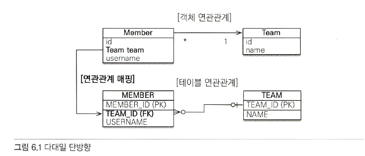

# 6.1 다대일
* 다대일 관계의 반대 방향은 항상 일대다 이다.
* 디비에서 외래키는 항상 다(N) 인 곳에 위치한다.
* 연관관계의 주인은 항상 다 쪽이다.

---

## 6.1.1 다대일 단방향 (n:1)

~~~java
@Entity
class Member {
    
    @Id
    @GeneratedValue
    private long id;
    
    private String userName;
    
    @ManyToOne
    @JoinColumn(name = "TEAM_ID")
    private Team team;
}

@Entity
class Team {
    @Id
    @GeneratedValue
    private long id;
}
~~~

---

## 6.1.2 다대일 양방향 (n:1 / 1:n)

~~~java
@Entity
class Member {
    
    @Id
    @GeneratedValue
    private long id;
    
    private String userName;
    
    @ManyToOne
    @JoinColumn(name = "TEAM_ID")
    private Team team;
    
    public void setTeam(Team team) {
        this.team = team;
        
        if (!this.team.getMembers().contains(this)) {
            team.getMembers().add(this);
        }
    }
}

@Entity
class Team {
    @Id
    @GeneratedValue
    private long id;
    
    @OneToMany(mappedBy = "team")
    private List<Member> members = new ArrayList<>();
    
    public void addMember(Member member) {
        this.members.add(member);
        
        if (member.getTeam() != null) {
            member.setTeam(this);
        }
    }
}
~~~

* 양방향은 외래 키가 있는 쪽이 연관관계의 주인이다.
* 양방향 연관관계는 항상 서로를 참조해야 한다.
  * 항상 서로를 참조해야 하며, 이때 연관관계 편의 메서드를 만들어주는 것이 좋다.
  * 위 코드에서는 무한루프 방지 로직을 추가했고 양방향으로 편의 메서드를 작성했다.

---

# 6.2 일대다 (1:n)

---
## 6.2.1 일대다 단방향 (1:n) (생략)

---

## 6.2.2 일대다 양방향 (1:n)
하나의 팀은 여러 회원을 참조할 수 있다. 위와 동일한 상황이지만 연관관계의 주인이 일(1) 쪽에 있는 경우다.

특이한 점은 1인 team 쪽이 연관관계의 주인이 되기 때문에 DB와 함께 본다면 다른 테이블에 있는 (Member) 외래키를 관리한다는 점이다.

엔티티 매핑은 아래와 같다.

~~~java
@Entity
class Member {

    @Id
    @GeneratedValue
    private long id;

    private String userName;

    @ManyToOne
    @JoinColumn(name = "TEAM_ID", insertable = false, updatable = false)
    private Team team;

    public void setTeam(Team team) {
        this.team = team;

        if (!this.team.getMembers().contains(this)) {
            team.getMembers().add(this);
        }
    }
}

@Entity
class Team {
    @Id
    @GeneratedValue
    private long id;

    @OneToMany
    @JoinColumn(name = "TEAM_ID")
    private List<Member> members = new ArrayList<>();

    public void addMember(Member member) {
        this.members.add(member);

        if (member.getTeam() != null) {
            member.setTeam(this);
        }
    }
}
~~~

* 일대다 관계에서 문제점은 연관관계의 주인이 일쪽이기 때문에 DB 테이블에 외래키는 다 쪽에 외치하고 있다는 것이다.
  * 일을 통해 다쪽이 아닌 일쪽을 수정하면 다쪽이 함께 수정된다.
  * 일을 수정하면 일에 대한 쿼리 / 외래키에 대한 수정은 다 쪽 테이블이 업데이트 되기 때문에 두 개의 쿼리가 전달된다.

위 코드를 실행하면 쿼리는 아래와 같다.

Member 엔티티는 Team에 대한 정보를 모르고 있고, 연관관계의 주인은 Team 이기 때문에

각각 Member를 영속화하고, Team을 영속화 한 다음, Team을 영속화 할때 엔티티 정보를 참조하여

Member 객체에 대한 영속화 update fk를 수행한다.

> 쓰지 말자.

---

일대다 양방향 매핑은 존재하지 않는다. 대신 다대일 양방향 매핑을 사용해야 한다.

* RDS 특성 상 외래키는 항상 다 쪽에 있기 때문에 일대다 관계에서 연관관계의 주인은 항상 ManyToOne 쪽이다.
  * 이런 이유로 ManyToOne쪽에는 mappedBy 속성이 없다.
* 유일한 방법은 일대다 단방향 매핑의 반대편에 같은 외래 키를 사용하는 대다일 연관관계를 설정하고, 읽기전용으로 처리해주면 된다.

일대다를 설정하고, 반대편에 대다일 연관관계를 만들고 읽기전용으로 만들었다.

이렇게 하면 외래키를 양쪽에서 관리하므로 다 쪽에 읽기 전용을 걸어 주었다.

이것도 쓰지말자!

---

# 6.3 일대일 (1:1)
일대일 관계는 양쪽이 서로 하나의 관계만 갖는다. 예를 들어, 회원과, 회원의 주민등록 테이블 관계이다.

* 일대일 관계는 반대도 일대일 이다.
* 테이블 관계에서 어디에 외래키가 있던 상관없다.
* 어디에 외래키를 둘지 설정한다.
  * 주 테이블에 위치 : 외래키를 회원 쪽에 둔다. 조회 시, 추가적인 쿼리가 발생하지 않아서 개발자들이 좋아한다.
    * 나중에 1:n 으로 변경하기가 어렵다.
  * 대상 테이블에 외래키
    * 좋다. 난 이거 쓴다.

---

## 6.3.1 주 테이블에 외래 키

> 양방향

~~~java
@Entity
public class Member {
    
    @OneToOne
    @JoinColumn(name = "LOCKER_ID")
    private Locker locker;
}

@Entity
public class Locker {
    
    @OneToOne(mappedBy = "locker")
    private Member member;
}
~~~

여기서는 외래키가 member에 있기 때문에 연관관계의 주인도 Member가 된다.

반대쪽인 locker에는 mappedBy 속성으로 매핑 되었음을 알려준다.

---

## 6.3.2 대상 테이블에 외래 키

대상 테이블에 외래 키를 알아보자.

> 단방향

외래키가 주테이블이 아닌 대상 테이블에 있는 일대일 단방향은 JPA에서 지원하지 않는다.

양방향이나 혹은 주 테이블에 외래키를 옮겨야 한다.

---

> 양방향

~~~java
@Entity
public class Member {
    
    @OneToOne(mappedBy = "member")
    private Locker locker;
}

@Entity
public class Locker {
    
    @OneToOne
    @JoinColumn(name = "MEMBER_ID")
    private Member member;
}
~~~

> 주의 : 위 상황에서 프록시의 한계로 Locker.member (연관관계의 주인에서 접근) 시, 지연 로딩이 가능하지만
> 
> member.locker (연관관계의 종속) 에서는 즉시 로딩된다.

---

# 6.4 다대다 (n:n)
RDB에서 정규화된 테이블 2개로 n:n을 표현할 수 없다. 그래서 일대다 / 다대일로 매핑할 수 있는 중간 테이블을 만들어서 사용한다.

근데 객체는 서로 간의 리스트를 가지고 있으면 다대다연관관계의 표현이 가능하다.

---

## 6.4.1 대다대 단방향
닥치고 엔티티 먼저 보자

~~~java
public class Member {
    
    @ManyToMany
    @JoinTable(
            name = "MEMBER_PRODUCT",
            joinColumns = @JoinColumn(name = "MEMBER_ID"),
            inverseJoinColumns = @JoinColumn(name = "PRODUCT_ID")
    )
    private List<Product> products = new ArrayList<>();
}

public class Product {
    
}
~~~

중요한 것은 중간 테이블 없이 이게 가능하는 점이다.

각 속성들을 알아보자 

* joinTable.name : 연결 테이블을 지정한다. 여기서는 MEMBER_PRODUCT 테이블을 설정하였ㅅ다.
* joinTable.joinColumns : 현재 방향인 회원과 매핑할 조인 컬럼 정보를 지정한다.
* joinTable.inverseJoinColumns: 반대 방향인 상품 테이블과 매핑할 조인 컬럼 정보를 지정한다.

연결 테이블을 이렇게 풀어냈다~

---

## 6.4.2 다대다 양방향
동일하게 양쪽을 모두 @ManyToMany로 정보를 알려주고, 주인이 아닌 곳에는 mappedBy 속성을 사용한다.

~~~java
import java.util.ArrayList;

public class Member {

  @ManyToMany
  @JoinTable(
          name = "MEMBER_PRODUCT",
          joinColumns = @JoinColumn(name = "MEMBER_ID"),
          inverseJoinColumns = @JoinColumn(name = "PRODUCT_ID")
  )
  private List<Product> products = new ArrayList<>();
}

@Entity
public class Product {
  @ManyToMany(mappedBy = "products")
  private List<Member> members = new ArrayList<>();
}
~~~

---

## 6.4.3 다대다 : 매핑의 한계와 극복, 연결 엔티티 사용
근데 위에껀 실무에서 못 쓴다. 한계가 있기 떄문이다.

중계 테이블에 양쪽의 아이디 말고 다른 컬럼도 넣어야 하는데 추가적인 컬럼들이 필요하다.

이 상황에는 ManyToMany를 그냥 그대로 쓸 수가 없다. 왜냐하면 새로 생성된 컬럼들은 매핑할 수 없기 때문이다.

결국에는 연결 테이블을 생성하고 엔티티로 만든다음에 여기에다가 추가해서 사용해야 한다.

상품과 회원 사이의 회원 상품 엔티티를 예시로 보자.

~~~java
import java.io.Serializable;
import java.util.ArrayList;

public class Member {

  @OneToMany(mappedBy = "member")
  private List<MemberProduct> memberProducts = new ArrayList<>();
}

@Entity
@IdClass(MemberProductId.class)
public class MemberProduct {

  @Id
  @ManyToOne
  @JoinColumn(name = "MEMBER_ID")
  private Member member;

  @Id
  @ManyToOne
  @JoinColumn(name = "PRODUCT_ID")
  private Product product;

  private int orderAmount;
}

public class MemberProductId implements Serializable {
    private String member;
    private String product;
    
    @Override
    public boolean equals(Object c) {
        
    }
}
~~~

회원 상품 엔티티를 보면 기본 키를 매핑하는 @Id와 외래 키를 매핑하는 @JoinColumn을 동시에 사용해서 

기본키 + 외래 키를 한 번에 매핑했다.

그리고 @IdClass를 사용해서 복합 키 매핑을 사용했다.

---

* 복합 기본 키

회원상품 엔티티처럼 기본 키가 복합키면 JPA에서 별도의 식별자 클래스를 만들어주고 @IdClass를 사용해서 식별자 클래스를 지정해줘야 한다.

특징은 아래와 같다.

1. 복합 키는 별도의 클래스로 만들어야 한다.
2. serializable을 구현해야 한다.
3. equals와 hashCode 메소드를 구현해야 한다.
4. 기본 생성자가 있어야 한다.
5. public이어야 한다.
6. @IdClass를 사용하는 방법 외에 @EmbaddedId를 사용하는 방법이 있다.

---

* 식별 관계

회원상품은 회원과 상품의 기본 키를 받아서 자신의 기본 키로 사용한다. 

이렇게 부모 테이블의 기본 키를 받아서 자신의 기본 키 + 외래 키로 사용하는 것을 식별 관계라고 한다.

종합해보면 회원상품은 회원의 기본 키를 받아서 자신의 기본 키로 사용함과 동시에 회원과의 관계를 위한 외래 키로 사용한다.

상품역시 마찬가지이며, MemberProductId 식별자 클래스로 두 기본 키를 묶어서 복합 기본 키로 사용한다.

---

## 6.4.4 다대다 : 새로운 기본 키 사용

위 방법이 복잡하기 때문에 추천하는 키본 키 생성 전략은 DB에서 자동생성해주는 대리키를 Long 값으로 사용하는 것이다.

비지니스와 무관하며 영구적으로 쓸 수 있다. 그리고 ORM 매핑 할 때 간단히 매핑을 할 수 있다.

괜히 헷갈리게 memberProduct를 order로 바꿔서 아래와 같이 만들어 본다.

코드는 그냥 똑같다. OneToMany / ManyToOne으로 지정해줬다.

그냥 개기지 말고 엔티티로 만들어서 다대다 관계를 풀어내는 것이 가장 아름답다.

