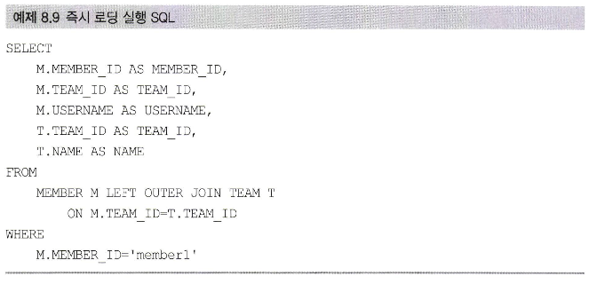

# 목차
---

# 서론
> 프록시와 즉시로딩, 지연로딩

객체는 연관된 객체들을 탐색한다.

그런데 객체 정보는 DB에 저장되어 있으므로 연관 객체를 탐색하는데는 제약조건이 따른다.

JPA 구현체들은 이 문제를 해결하기 위해 프록시라는 기술을 사용한다.

프록시를 통해 실제 사용하는 시점에 DB에서 객체 정보를 조회할 수 있다.

하지만 성능 이슈로 인해 자주 함께 사용되는 객체는 조인을 통해 함께 조회하는 것이 효과적이다.

JPA는 지연로딩, 즉시로딩을 모두 지원한다.

> 영속성 전이와 고아 객체

JPA는 연관된 객체를 함께 저장하거나 함께 삭제할 수 있는 영속성 전이와 고아 객체 제거라는 편리한 기능을 제공한다.

---

# 8.1 프록시
엔티티를 조회할 때 늘 모든 연관관계의 데이터를 사용하지는 않는다.

예를 들어, 주문서 자체에 대한 정보만 필요하다면, 주문상세연관관계 엔티티의 정보는 참조하지 않는다.

이 상황에서 즉시 로딩으로 주문서를 조회할 때 주문 상세의 데이터도 모두 메모리에 올리는 것은 효율적이지 않다.

이런 문제를 해결하기 위해 엔티티가 실제 참조될때까지 데이터베이스에서 조회를 지연하는 방법을 JPA는 제공하는데

이를 지연로딩이라고 한다. 그리고 실제 조회 전까지 연관관계엔티티 대신 데이터베이스에 조회를 지연할 대리 객체가 필요한데 이를 프록시라고 한다.

아래 예시를 보자.

~~~java

import java.util.ArrayList;

@Entity
@Getter
public class Order {
    
    @OneToMany(mappedBy = "order")
    private List<OrderDetail> orderDetails = new ArrayList<>();
    private String orderNo;
}

@Entity
public class OrderDetail {
    
    @ManyToOne
    @JoinColumn(name="ORDER_DETAIL_ID")
    private Order order;
}

public static void main(String[] args) {
    em.find(Order.class, 1).getOrderName();
}
~~~

위 코드에서 주문 객체를 조회해서 주문번호를 가져오는데, 이때 주문상세의 정보는 필요없다. JPA 구현체는 위 상황에서 연관관계인 주문상세 엔티티를 로딩하지 않고

실제 참조되는 시점까지 로딩을 지연시킬 수 있다.

기본적으로 엔티티에 지연로딩을 명세하지 않으면 즉시 로딩으로 가져오게 된다. 엔티티 양쪽에 설정을 해줘야 한다.

---

## 8.1 프록시 기초
JPA에서 식별자로 엔티티 하나를 조회할 때는 EntityManager.find()를 사용한다.

이 메소드는 영속성 컨텍스트에 엔티티가 없으면 DB를 조회한다.

~~~
Member member = em.find(Member.class, "11");
~~~

이렇게 엔티티를 직접 조회하면 실제 사용하든 사용하지 않든 즉시 연관 객체를 모두 조회한다.

~~~
EntityManager.getReference(Member.class, "11");
~~~

위 처럼호출하면 엔티티를 실제 사용하는 시점까지 DB 조회를 미루게 된다. 위 메소드를 호출할 때 JPA는 DB를 조회하지 않고 실제 엔티티 객체도 생성하지 않는다.

대신에 DB 접근을 위임한 프록시 객체를 반환한다.

---

### 프록시의 특징
프록시는 실제 클래스를 상속 받아서 만들어지므로 클라이언트 입장에서는 실제 클래스와 구분하지 않고 사용할 수 있다.

---

### 프록시 객체의초기화
프록시 객체는 member.getName() 처럼 실제 사용될 때 DB를 호출해 조회해서 실제 엔티티 객체를 생성하는데 이를 프록시 객체의 초기화라고 한다.

---

### 프록시 객체의 특징
* 프록시 객체는 원본이 아니므로 typeof 등으로 타입 체크를 할 때 주의해야 한다.
* 영속성 컨텍스트의 도움이 필요하기 때문에 트랜젝션 안에서 유효하다.

---

## 8.1.2 프록시와 식별자
엔티티를 프록시로 조회할때 식별자 값을 파라미터로 저장하고 프록시는 객체 내부에 이 값을 저장한다.

즉, team.getId() 등의 메서드를 사용할 시에는 프록시 객체를 초기화 하지 않는다. 이미 알고 있기 때문이다.

하지만 이는 역시 엔티티 접근 방식이 Field 인 경우에는 초기화를 진행한다. 

properties로 접근 방식이 설정된 경우에는 초기화 하지 않는다.

그 이유는 엔티티 접근 방식이 프로퍼티로 되어있어야만 getId() 메서드가 식별자만 가져오는 값이라고 판단하기 때문이다.

참고로 연관관계를 설정할 때는 접근 방식을 필드로 해도 프록시를 초기화 하지 않는데 그 이유는 연관관계를 매핑할때

주로 식별자를 사용하기 때문이다.

---

# 8.2 즉시 로딩과 지연 로딩

## 8.2.1 즉시 로딩
즉시 로딩을 사용하기 위해서는 연관관계를 알려주는 @ManyToOne 등의 어노테이션에 fetch 속성의 값으로 FetchType.Eager를 명세한다.

~~~java

@Entity
public class Member {
    @ManyToOne(fetch = FetchType.Eager)
    private Team team;
}
~~~

이 경우, 회원 조회 시 팀의 정보도 즉시 로딩된다.

대부분의 JPA 구현체는 즉시 로딩을 최적화하기위해 가능하면 조인 쿼리를 사용한다.

---

## 8.2.2 지연로딩
지연 로딩을 사용하기 위해서는 연관관계를 알려주는 @ManyToOne 등의 어노테이션에 fetch 속성의 값으로 FetchType.LAZY를 명세한다.

~~~java
@Entity
public class Member {
    @ManyToOne(fetch = FetchType.LAZY)
    private Team team;
}
~~~

조회 시, team 객체 대신에 프록시를 반환하고 사용 시점까지 초기화를 미룬다.

---

# 8.3
## 8.3.1 프록시와 컬랙션 레퍼
하이버네이트는 컬렉션을 영속화할때 컬렉션을 컬렉션 레퍼로 변경하는데 그 이유는 컬렉션에 대한 추적과 관리이다.

---

## 8.3.2 JPA 기본 페치 전략
xxToOne 이면 즉시 로딩을, xxToMany면 지연로딩이 원칙이다.

하나짜리면 바로 가져오고 여러 개면 지연 로딩 하는게 상식이다.

하지만 전부 지연로딩을 사용하고 필요한 곳에서만 즉시 로딩을 하는 것을 추천한다.

쓸지 안쓸지 모르기 때문이다.

---

## 8.3.3 FetchType.EAGER 사용 시 주의 점
2개 이상의 연관관계 컬렉션을 즉시 로딩 하는 것은 권장하지 않는다.

조인이 n개 들어가기 때문에 너무 많은 데이터가 메모리에 로딩 되기 때문이다.

---

# 8.4 영속성 전이
특정 엔티티를 영속 상태로 만들 때 연관된 객체도 함께 영속화 하고 싶다면 영속성 전이 기능을 사용하면 된다.

JPA는 CASCADE 옵션으로 영속성 전이를 제공한다. 쉽게 말하면 부모가 영속화 될 때 자식도 영속화 된다는 것이다.

이렇게 부모쪽에 속성값을 넣어주면 부모를 영속화할때 Many쪽도 함께 영속화 된다.

이는 성능과 아무 관련도 없고, 매핑과도 관련이 없고 편리함만 제공한다.

---

# 8.5 고아 객체
